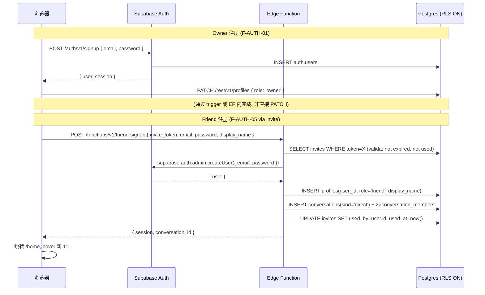

# Nook · API Design v1.0 (Stage 10)

> **Stage 10 · API Design — Frozen for Nook v1.0**
> 文档生成日：2026-06-27 · 关联：`Nook-SPEC v1.0.1`（SoT）· `Nook-ARCH-DESIGN-v1.0.md`（架构）· `Nook-DATA-MODEL.md v1.0.1`（数据模型）
> 性质：**完整 API 契约** — 包含 REST endpoint 定义、Edge Function handler 签名、Realtime/WS 事件 schema、错误码枚举、OpenAPI-style 类型定义。
> 本文档不输出：前端 UI 实现 / 后端 SQL DDL / 数据库 migration。这些分别在 Stage 11（DB Schema）和 M1-M7 代码实现中完成。

---

## 0. 元规则

### 0.1 文档层级

| 层 | 文档 | 与本文关系 |
|---|---|---|
| **需求** | `../01_Product/Nook-SPEC.md § 8` — 25 项 CAP | 本文实现覆盖全部 25 CAP |
| **架构** | `Nook-ARCH-DESIGN-v1.0.md § 6` — API 骨架 | 本文的严格超集；以下章节细化 |
| **数据** | `Nook-DATA-MODEL.md` — 13 实体定义 | 本文 schema 直接映射实体字段 |
| **API** | **本文** — 完整契约 | — |

### 0.2 与 SPEC CAP 的映射约定

- 每个 endpoint 标注对应 CAP-ID（如 `CAP-09`）
- 缺少 CAP 覆盖的 endpoint 是基础设施（如 `cleanup-storage-orphans`）
- CAP-ID 在 SPEC 冻结后不可增减；如有需要走新 SPEC 版本

### 0.3 变更日志

| 日期 | 版本 | 变更 |
|---|---|---|
| 2026-06-27 | v1.0 | 初版。基于 SPEC v1.0.1 + ARCH-DESIGN v1.0 + DATA-MODEL v1.0.1 生成 |

---

## 1. API 设计原则

### 1.1 核心原则

| # | 原则 | 体现 |
|---|---|---|
| **API-01** | **RLS 是授权，API 是门面** | 所有业务表 CRUD 走 Supabase auto-generated REST，RLS 守权限；Edge Functions 仅用于需要 `service_role` 的原子操作 |
| **API-02** | **最小暴露** | 不对外暴露 `auth.users` 表；`supabase-js` client 仅持有 `anon_key`（非 service_role） |
| **API-03** | **幂等优先** | 所有写入操作支持 `client_msg_id` 幂等键（消息）或在 EF 层做 idempotency check |
| **API-04** | **乐观并发** | 客户端先 render 后 sync（optimistic UI）；Realtime 增量修正 |
| **API-05** | **自描述错误** | 所有错误返回统一格式 `{ error: { code, message, details? } }`（见 § 3） |
| **API-06** | **单通道原则** | 实时数据走 Realtime WSS；REST 仅用于快照 / 历史 / admin 操作。二者不混用 |

### 1.2 端点类别

| 类别 | 基路径 | 鉴权 | 适用场景 |
|---|---|---|---|
| **REST (auto)** | `https://<project>.supabase.co/rest/v1/` | JWT (anon key) + RLS | 业务表 CRUD：messages / reactions / profiles / conversations / conversation_members |
| **Edge Function** | `https://<project>.supabase.co/functions/v1/` | JWT (service_role 内部) | 需要跨表原子操作的 admin 行为：invite / signup / reset-pwd / delete-friend |
| **Realtime WSS** | `wss://<project>.supabase.co/realtime/v1/websocket` | JWT (anon key) + RLS | 实时消息 / presence / typing / 未读更新 |
| **Auth (GoTrue)** | `https://<project>.supabase.co/auth/v1/` | — | 注册 / 登录 / session refresh |
| **Storage** | `https://<project>.supabase.co/storage/v1/` | JWT + bucket RLS | 文件上传 / 下载（signed URL） |
| **RPC** | `https://<project>.supabase.co/rest/v1/rpc/` | JWT (anon key, security invoker) | 自定义 SQL 函数（unread counts / mark read） |

---

## 2. 认证与鉴权 (Auth Flow)

### 2.1 注册流程





**关键决策**：Friend 注册走 Edge Function 而非直接 `supabase.auth.signUp()`。原因：
1. 需要 `service_role` 在一条请求内完成「注册 + 写 profile + 建 1:1 + 标记 invite」
2. 避免客户端持有 `service_role` key
3. 单点失败 → 单点 debug

### 2.2 Session & Token 管理

| 令牌 | 位置 | 有效期 | 刷新方式 |
|---|---|---|---|
| **access_token (JWT)** | 内存 / localStorage（supabase-js 默认） | 1 hour | `supabase.auth.refreshSession()` 自动 |
| **refresh_token** | localStorage（supabase-js 默认） | 30 days | 自动在 access_token 过期前调用 |
| **storage signed URL** | 临时 URL | 3 minutes（短期） | 每个查看请求重新生成 |

**安全约束**：
- SERVICE_ROLE_KEY 永不进客户端（仅 EF env）
- JWT 默认含 `aud`, `role`, `sub`(auth.users.id) 等标准 claims
- profiles.role 的 `owner` / `friend` 区分在应用层验证（RLS 中 `auth.uid()` 联表查询）

### 2.3 Auth 端点汇总

| 端点 | 方法 | CAP | 说明 |
|---|---|---|---|
| `/auth/v1/signup` | POST | CAP-01 | Owner 注册。Friend 不走这里。 |
| `/auth/v1/token?grant_type=password` | POST | CAP-02 | Owner / Friend 登录 |
| `/auth/v1/token?grant_type=refresh_token` | POST | — | session 刷新 |
| `/auth/v1/logout` | POST | — | 登出 |

> ✨ **设计决定**：Nook v1.0 不实现「忘记密码 / 邮件重置」流（INTERVIEW Round-1 Q6）。Owner 在 admin UI 直接重置 friend 密码。

---

## 3. 错误处理 (Error Handling)

### 3.1 统一错误格式

所有错误响应（HTTP 4xx/5xx + Realtime error payloads）遵循：


```typescript
interface ApiError {
  error: {
    code: ErrorCode;         // 机器可读的枚举值
    message: string;         // 人类可读的描述（参与 i18n）
    details?: Record<string, unknown>;  // 可选附加信息（字段级验证错误等）
    request_id?: string;     // 用于追踪（Sentry 关联）
  };
}
```


### 3.2 错误码枚举


```typescript
// === AUTH (E_AUTH_*) 认证/鉴权错误 ===
type ErrorCodeAuth =
  | 'E_AUTH_UNAUTHORIZED'       // 401: 未登录 / token 过期
  | 'E_AUTH_FORBIDDEN'          // 403: 已登录但权限不足（非 owner 调用 admin API）
  | 'E_AUTH_EMAIL_EXISTS'       // 409: 注册时 email 已被使用
  | 'E_AUTH_INVALID_CREDENTIALS'// 401: 登录时 email/password 不匹配
  | 'E_AUTH_WEAK_PASSWORD'      // 422: 密码 < 8 字符
  | 'E_AUTH_OWNER_EXISTS'       // 409: 已存在 Owner 时试图创建第二个 Owner

// === VALIDATION (E_VAL_*) 业务规则/校验错误 ===
type ErrorCodeValidation =
  | 'E_VAL_REQUIRED_FIELD'      // 422: 缺少必填字段
  | 'E_VAL_INVALID_FORMAT'      // 422: 字段格式不正确（email / mime 等）
  | 'E_VAL_EXCEEDS_LIMIT'       // 422: 超出限制（文件 > 50MB / 名称 > 32 字符）
  | 'E_VAL_EDIT_WINDOW_EXPIRED' // 422: 编辑窗口超过 2 分钟
  | 'E_VAL_RECALL_WINDOW_EXPIRED'// 422: 撤回窗口超过 2 分钟
  | 'E_VAL_DISPLAY_NAME_EMPTY'  // 422: display_name 不可为空

// === RESOURCE (E_RES_*) 资源错误 ===
type ErrorCodeResource =
  | 'E_RES_NOT_FOUND'           // 404: 资源不存在（message / conversation / profile）
  | 'E_RES_CONVERSATION_FULL'   // 409: 群已满 8 人
  | 'E_RES_GROUP_LIMIT_REACHED' // 409: 已达 4 群上限
  | 'E_RES_INVITE_EXPIRED'      // 410: invite token 已过期（24h）
  | 'E_RES_INVITE_USED'         // 410: invite token 已被使用
  | 'E_RES_INVITE_REVOKED'      // 410: invite token 已被 owner 撤销
  | 'E_RES_OWNER_DELETED'       // 410: 邀请人 (owner) 账号已不存在
  | 'E_RES_MESSAGE_TTL_DELETED' // 410: 消息已被 30 天 TTL 清理，操作无法完成
  | 'E_RES_ALREADY_MEMBER'      // 409: 用户已是该会话成员

// === SYSTEM (E_SYS_*) 系统错误 ===
type ErrorCodeSystem =
  | 'E_SYS_INTERNAL'           // 500: 服务器内部错误（未捕获异常）
  | 'E_SYS_RATE_LIMITED'       // 429: 请求频率超限
  | 'E_SYS_MAINTENANCE'        // 503: 维护模式
  | 'E_SYS_SERVICE_UNAVAILABLE'// 502: Supabase 服务本身不可用

type ErrorCode = ErrorCodeAuth | ErrorCodeValidation | ErrorCodeResource | ErrorCodeSystem;
```


### 3.3 HTTP 状态码映射策略

| 场景 | HTTP 状态 | ErrorCode |
|---|---|---|
| 登录/注册成功 | 200 / 201 | — |
| 未登录 | 401 | `E_AUTH_UNAUTHORIZED` |
| 权限不足 | 403 | `E_AUTH_FORBIDDEN` |
| 资源不存在 | 404 | `E_RES_NOT_FOUND` |
| 资源已过期/不存在 | 410 | `E_RES_INVITE_EXPIRED` 等 |
| 通用校验失败 | 422 | `E_VAL_*` |
| 业务冲突（容量超限等） | 409 | `E_RES_*` |
| 频率限制 | 429 | `E_SYS_RATE_LIMITED` |
| 服务端错误 | 500 | `E_SYS_INTERNAL` |

> **设计原则**：永不向客户端暴露 SQL 错误细节。所有 `raise exception` 在 trigger 中被 EF 或 RLS pb 捕获，映射为友好错误码。Edge Functions 内使用 try-catch 包裹所有 DB 操作。

### 3.4 Supabase 错误映射

Supabase 原生错误需要统一 `catch` 后映射为 Nook 错误格式：


```typescript
// lib/api/errors.ts (shared 层)
function mapSupabaseError(error: PostgrestError): ApiError {
  switch (error.code) {
    case '42501': // RLS policy violation
      return { error: { code: 'E_AUTH_FORBIDDEN', message: '你没有权限执行此操作' } };
    case 'P0001':  // raise exception (trigger)
      if (error.message === 'CONV_HARD_CAP')
        return { error: { code: 'E_RES_GROUP_LIMIT_REACHED', message: '已达 4 群上限' } };
      if (error.message === 'MEMBER_HARD_CAP')
        return { error: { code: 'E_RES_CONVERSATION_FULL', message: '该群已满' } };
      if (error.message === 'EDIT_WINDOW_EXPIRED')
        return { error: { code: 'E_VAL_EDIT_WINDOW_EXPIRED', message: '编辑窗口已超过 2 分钟' } };
      return { error: { code: 'E_SYS_INTERNAL', message: '操作被拒绝' } };
    // ... 其他映射
    default:
      return { error: { code: 'E_SYS_INTERNAL', message: '未知错误，请稍后重试' } };
  }
}
```


---

## 4. REST Endpoints (自动生成 · Supabase REST + RLS)

> 所有 REST endpoint 的 base URL: `https://<project>.supabase.co/rest/v1/`。请求通过 `supabase-js` client 发出，自动附带 JWT。响应格式为 JSON。

### 4.1 通用约定

| 约定项 | 值 |
|---|---|
| **Content-Type** | `application/json` |
| **Prefer header** | `return=representation`（CREATE/UPDATE 返回完整行） |
| **分页** | 使用 `Range` header 或 `limit + offset` query 参数 |
| **筛选** | `column=eq.value`（Supabase REST 语法） |
| **排序** | `order=column.desc` |
| **关联** | `select=*,relation_table(*)` |

### 4.2 端点详细定义

#### 4.2.1 `GET /messages` — CAP-06 拉取消息列表


```typescript
// Request
GET /rest/v1/messages
  ?conversation_id=eq.<uuid>
  &order=created_at.desc
  &limit=50
  &select=*,attachments(*),reactions(*)

// Headers
Authorization: Bearer <access_token>
Accept: application/json

// Response (200)
type MessageListResponse = {
  id: string;                    // UUID
  conversation_id: string;
  sender_id: string;
  kind: 'text' | 'image' | 'file';
  body: string | null;
  attachment_id: string | null;
  reply_to_id: string | null;
  client_msg_id: string | null;
  created_at: string;           // ISO 8601
  edited_at: string | null;
  recalled_at: string | null;
  deleted_by_sender_at: string | null;  // 列级 GRANT: 其他用户看到 null
  attachments: Attachment | null;
  reactions: Reaction[];
}[];

// Error codes
// 401: E_AUTH_UNAUTHORIZED
// 403: E_AUTH_FORBIDDEN (非该会话成员)
// 422: E_VAL_REQUIRED_FIELD (缺少 conversation_id)

// RLS: messages_read_member — 仅该会话 active 成员可读
```


#### 4.2.2 `POST /messages` — CAP-09 发送文字消息


```typescript
// Request
POST /rest/v1/messages
Content-Type: application/json
Prefer: return=representation

{
  conversation_id: string;   // UUID
  sender_id: string;         // 必须 = auth.uid() (RLS 守)
  kind: 'text';              // 文字消息
  body: string;              // 1-4000 字符
  reply_to_id?: string;      // UUID，可选引用
  client_msg_id: string;     // UUID v4，幂等键
}

// Response (201)
type Message = {
  id: string;
  conversation_id: string;
  sender_id: string;
  kind: 'text';
  body: string;
  reply_to_id: string | null;
  client_msg_id: string;
  created_at: string;
  // ... 其他字段为 null
};

// Error codes
// 401: E_AUTH_UNAUTHORIZED
// 403: E_AUTH_FORBIDDEN (sender_id ≠ auth.uid())
// 409: E_RES_CONVERSATION_FULL (不适用文字消息，但如果 sender 已不是成员则返回)
// 422: E_VAL_REQUIRED_FIELD (body 为空) / E_VAL_EXCEEDS_LIMIT (>4000)

// RLS: messages_insert_self — sender_id = auth.uid() 且是 conv 活跃成员
// Unique: messages_client_msg_id_unique_idx 保障幂等

// 客户端幂等行为:
// - 发送前生成 client_msg_id = crypto.randomUUID()
// - 服务端检测到相同 (conversation_id, client_msg_id) 时，返回已存在的 row (不重复插入)
// - 客户端据此 dedupe
```


#### 4.2.3 `PATCH /messages` — CAP-12/CAP-13 编辑 / 撤回消息


```typescript
// --- 编辑 (CAP-12) ---
PATCH /rest/v1/messages?id=eq.<uuid>
Content-Type: application/json
Prefer: return=representation

{
  body: string;              // 更新后的正文
}

// 注意: 编辑仅允许在 2 分钟内 (由 trg_messages_edit_window 触发守门)
// edited_at 由 trigger 自动设置，不允许客户端传入

// --- 撤回 (CAP-13) ---
PATCH /rest/v1/messages?id=eq.<uuid>
Content-Type: application/json
Prefer: return=representation

{
  recalled_at: "now()"       // 或者客户端不传 body，让 EF 设置；简化：客户端直接传 ISO 时间
}

// 注意: 撤回窗口 2 分钟（应用层 check）+ DB trigger 不检查
// 但实际上 RLS + 应用层共同守

// --- 删除(本地) (CAP-14) ---
PATCH /rest/v1/messages?id=eq.<uuid>
Content-Type: application/json
Prefer: return=representation

{
  deleted_by_sender_at: "2026-06-27T12:00:00Z"   // 列级软删
}

// Error codes
// 401: E_AUTH_UNAUTHORIZED
// 403: E_AUTH_FORBIDDEN (not sender)
// 422: E_VAL_EDIT_WINDOW_EXPIRED (编辑超过 2 分钟)
// 410: E_RES_MESSAGE_TTL_DELETED (消息已被 30 天 TTL 清理)

// RLS: messages_update_sender — sender_id = auth.uid()
// 列级 GRANT: 仅允许更新 (body, deleted_by_sender_at)
```


#### 4.2.4 `POST /reactions` & `DELETE /reactions` — CAP-15 反应


```typescript
// --- 添加反应 ---
POST /rest/v1/reactions
Content-Type: application/json
Prefer: return=representation

{
  message_id: string;   // UUID
  user_id: string;      // 必须 = auth.uid() (RLS 守)
  emoji: '👍' | '❤️' | '😂' | '👀' | '🔥' | '🙏';
}

// Response (201)
// 注意: (message_id, user_id, emoji) 复合唯一
// 如果同一 user 对同一 message 加同一 emoji → 幂等返回已存在行 (upsert 行为)
// 如果同一 user 对同一 message 加不同 emoji → 先删旧的再插新的 (应用层切换语义)

// --- 删除反应 ---
DELETE /rest/v1/reactions
  ?message_id=eq.<uuid>
  &user_id=eq.<uuid>
  &emoji=eq.<emoji>

// Response (204, no content)

// Error codes
// 401: E_AUTH_UNAUTHORIZED
// 403: E_AUTH_FORBIDDEN (user_id ≠ auth.uid())
// 422: E_VAL_INVALID_FORMAT (emoji 不在枚举中)

// RLS: reactions_insert_self (INSERT), reactions_delete_self (DELETE)
```


#### 4.2.5 `PATCH /profiles` — CAP-16 修改 display_name / status


```typescript
PATCH /rest/v1/profiles?id=eq.<uuid>
Content-Type: application/json
Prefer: return=representation

{
  display_name?: string;    // 1-32 字符
  status_emoji?: string;    // null 或 6 个 emoji 之一
  status_text?: string;     // 0-20 字符
}

// Response (200)
// 注意: avatar_url 通过 Storage API 上传后再 PATCH 写入

// RLS: profiles_update_self — id = auth.uid()
// Error codes
// 401: E_AUTH_UNAUTHORIZED
// 422: E_VAL_DISPLAY_NAME_EMPTY (display_name 为空)
// 422: E_VAL_EXCEEDS_LIMIT (超出长度限制)
```


#### 4.2.6 `PATCH /conversations` — CAP 重命名群 (Owner only)


```typescript
PATCH /rest/v1/conversations?id=eq.<uuid>
Content-Type: application/json
Prefer: return=representation

{
  name: string;             // 1-32 字符，仅 group 可改名
}

// RLS: conversations_update_owner — created_by = auth.uid() (仅 Owner)
// 注意: 1:1 对话不能改名 (SPEC § 2.2 F-CONV-04)
```


#### 4.2.7 `POST /rpc/fn_unread_counts` — CAP-21 未读数


```typescript
// Request
POST /rest/v1/rpc/fn_unread_counts
Content-Type: application/json
// 不需要 body (security invoker 自动取 auth.uid())

// Response (200)
type UnreadCountsResponse = {
  conversation_id: string;
  count: number;             // 该会话中的未读消息数 (>9 显示 "9+")
}[];

// 调用频率: 进入 /home 时 + 30s 定时轮询
// 也可配合 Realtime user channel 增量推送 (v1.0 简化：仅 poll)
```


#### 4.2.8 `POST /rpc/fn_mark_conversation_read` — CAP-21b 标记已读


```typescript
// Request
POST /rest/v1/rpc/fn_mark_conversation_read
Content-Type: application/json

{
  p_conv: string;  // conversation UUID
}

// Response (204, no content)

// 调用时机: 用户进入某会话 / 滚动到底部 (IntersectionObserver)
// 实现: UPDATE conversation_members SET last_read_at = now()
```


### 4.3 Storage Endpoints (文件上传)


```typescript
// --- 上传头像 (CAP-17) ---
POST /storage/v1/object/avatars/<user_id>/<filename>
Content-Type: multipart/form-data
Authorization: Bearer <access_token>

// Body: binary image data (≤ 5 MB, image/*)
// Response: { Key: "avatars/<user_id>/<filename>" }

// 上传成功后, PATCH profiles.avatar_url = storage_path

// --- 上传消息附件 (image/file) (CAP-10/11) ---
POST /storage/v1/object/attachments/<uuid>/<filename>
Content-Type: multipart/form-data
Authorization: Bearer <access_token>

// Body: binary data (≤ 50 MB)
// Response: { Key: "attachments/<uuid>/<filename>" }

// 上传成功后, INSERT attachments row → INSERT messages with attachment_id

// --- 获取附件下载 URL (signed) ---
GET /storage/v1/object/public/attachments/<path>?<signed-params>
// 或通过
POST /storage/v1/object/sign/attachments/<path>
Content-Type: application/json
{ "expiresIn": 180 }  // 3 分钟有效期

// Bucket RLS:
// - avatars: public 可读（同 conv 成员）
// - attachments: 仅该消息所在 conv 的 active 成员可读
```


### 4.4 Entity Schema REST 端点汇总表

| CAP | 方法 | 路径 | 请求体 / 参数 | 响应 | RLS |
|---|---|---|---|---|---|
| CAP-06 | GET | `/rest/v1/messages` | `conversation_id, limit, offset` | `Message[]` | conv 成员 |
| CAP-09 | POST | `/rest/v1/messages` | `{conversation_id, sender_id, kind, body, reply_to_id?, client_msg_id}` | `Message` | sender=self + conv 成员 |
| CAP-12 | PATCH | `/rest/v1/messages` | `{body}` | `Message` + edited_at | sender=self + 2min trigger |
| CAP-13 | PATCH | `/rest/v1/messages` | `{recalled_at}` | `Message` | sender=self |
| CAP-14 | PATCH | `/rest/v1/messages` | `{deleted_by_sender_at}` | `Message` | sender=self |
| CAP-15 | POST | `/rest/v1/reactions` | `{message_id, user_id, emoji}` | `Reaction` | self + conv 成员 |
| CAP-15 | DELETE | `/rest/v1/reactions` | query params | 204 | self |
| CAP-16 | PATCH | `/rest/v1/profiles` | `{display_name?, status_emoji?, status_text?}` | `Profile` | self |
| CAP-17 | POST | `/storage/v1/object/avatars/` | multipart binary | `{Key}` | self (RLS bucket) |
| CAP-18 | — | (localStorage) | i18next 切换 | — | 纯客户端 |
| CAP-22 | GET | `/rest/v1/conversations` | `select=*,members(*)` | `Conversation[]` | 仅成员 |
| CAP-23 | GET | `/rest/v1/conversation_members` | `conversation_id, left_at=is.null` | `Member[]` | 同 conv 成员 |
| CAP-21 | POST | `/rest/v1/rpc/fn_unread_counts` | — | `{conv_id, count}[]` | security invoker |
| CAP-21b | POST | `/rest/v1/rpc/fn_mark_conversation_read` | `{p_conv}` | 204 | security invoker |

---

## 5. Edge Function Handlers (EF · Deno)

> Base URL: `https://<project>.supabase.co/functions/v1/`

### 5.1 通用模式


```typescript
// supabase/functions/_shared/auth.ts
import { serve } from 'https://deno.land/std@0.177.0/http/server.ts';
import { createClient } from 'https://esm.sh/@supabase/supabase-js@2';

interface AuthenticatedRequest {
  userId: string;       // auth.uid() from JWT
  role: 'owner' | 'friend';
  body: unknown;
}

async function authenticate(req: Request): Promise<AuthenticatedRequest> {
  const authHeader = req.headers.get('Authorization')?.replace('Bearer ', '');
  if (!authHeader) throw new Error('E_AUTH_UNAUTHORIZED');

  const supabase = createClient(
    Deno.env.get('SUPABASE_URL')!,
    Deno.env.get('SUPABASE_ANON_KEY')!,
    { global: { headers: { Authorization: req.headers.get('Authorization')! } } }
  );

  const { data: { user }, error } = await supabase.auth.getUser(authHeader);
  if (error || !user) throw new Error('E_AUTH_UNAUTHORIZED');

  // 查 profiles 获取 role
  const { data: profile } = await supabase
    .from('profiles')
    .select('role')
    .eq('id', user.id)
    .single();

  // EF 内用 service_role 执行后续操作
  return {
    userId: user.id,
    role: profile?.role ?? 'friend',
    body: await req.json(),
  };
}

// supabase/functions/_shared/response.ts
function ok(data: unknown) {
  return new Response(JSON.stringify(data), {
    status: 200,
    headers: { 'Content-Type': 'application/json' },
  });
}

function err(code: string, message: string, status = 400) {
  return new Response(JSON.stringify({ error: { code, message } }), {
    status,
    headers: { 'Content-Type': 'application/json' },
  });
}
```


### 5.2 `friend-signup` — CAP-04 接受邀请注册


```typescript
// POST /functions/v1/friend-signup
// Auth: JWT required (但实际是「受邀者首次注册」- 无 JWT; 使用 EF 的匿名 + service_role 模式)

// Request
{
  invite_token: string;      // 24-byte hex token
  email: string;             // RFC 5322 email
  password: string;          // ≥ 8 字符
  display_name: string;      // 1-32 字符
}

// 处理流程:
// 1. Validate invite_token (not expired, not used, not revoked)
// 2. Validate email + password format
// 3. supabase.auth.admin.createUser({ email, password, email_confirm: true })
// 4. INSERT INTO profiles (id, display_name, role) VALUES (user.id, display_name, 'friend')
// 5. Check invite.target_kind:
//    - 'any' → INSERT conversation (kind='direct') + 2×conversation_members (owner + friend)
//    - 'conversation' → INSERT conversation_members (friend) INTO target_conversation_id
// 6. UPDATE invites SET used_by = user.id, used_at = now()
// 7. Sign in with the new credentials to get a session

// Response (201)
{
  session: {
    access_token: string;
    refresh_token: string;
    user: { id: string; email: string };
  };
  conversation_id: string | null;  // 自动创建的 1:1 conv id
}

// Error codes
// 400: E_VAL_REQUIRED_FIELD (缺少必填字段)
// 400: E_VAL_INVALID_FORMAT (email 格式错 / password < 8)
// 410: E_RES_INVITE_EXPIRED (token 过期 >24h)
// 410: E_RES_INVITE_USED (token 已被使用)
// 410: E_RES_INVITE_REVOKED (token 被 owner 撤销)
// 409: E_RES_ALREADY_MEMBER (该 email 已在系统中，属于 active friend)
// 500: E_SYS_INTERNAL (注册失败)

// 幂等: invite_token 有 unique 约束 + used_at 检查，不可能重复使用
```


### 5.3 `admin-create-invite` — CAP-03 创建邀请


```typescript
// POST /functions/v1/admin-create-invite
// Auth: 仅 Owner (role check)

// Request
{
  target_kind: 'any' | 'conversation';
  target_conversation_id?: string;   // target_kind='conversation' 时必填
}

// 处理流程:
// 1. Verify auth user is owner (profile.role = 'owner')
// 2. If target_kind = 'conversation': verify conversation exists & not full
// 3. INSERT INTO invites (token, created_by, target_kind, target_conversation_id, expires_at)
//    token = gen_random_bytes(24) → hex → 48 chars
//    expires_at = now() + 24h
// 4. Return invite URL

// Response (201)
{
  invite: {
    token: string;           // 48 字符 hex
    url: string;             // 完整 URL: https://nook.app/invite/<token>
    expires_at: string;      // ISO 8601 (now + 24h)
  };
}

// Error codes
// 401: E_AUTH_UNAUTHORIZED
// 403: E_AUTH_FORBIDDEN (不是 Owner)
// 409: E_RES_CONVERSATION_FULL (目标群已满 8 人)
// 422: E_VAL_REQUIRED_FIELD (target_conversation_id 缺失)

// 注: 不限制 pending invite 数量 (v1.0 简化)
```


### 5.4 `admin-reset-password` — CAP-19 重置密码


```typescript
// POST /functions/v1/admin-reset-password
// Auth: 仅 Owner

// Request
{
  friend_auth_id: string;   // auth.users.id (UUID)
  new_password: string;     // ≥ 8 字符
}

// 处理流程:
// 1. Verify caller is owner
// 2. Validate friend exists (profiles.role = 'friend')
// 3. supabase.auth.admin.updateUserById(friend_auth_id, { password: new_password })
// 4. Log event to app_events

// Response (200)
{
  success: true;
  message: '密码已重置';
}

// Error codes
// 401: E_AUTH_UNAUTHORIZED
// 403: E_AUTH_FORBIDDEN (不是 Owner)
// 404: E_RES_NOT_FOUND (friend 不存在)
// 422: E_VAL_WEAK_PASSWORD (密码 < 8 字符)
```


### 5.5 `admin-delete-friend` — CAP-20 删除朋友


```typescript
// POST /functions/v1/admin-delete-friend
// Auth: 仅 Owner

// Request
{
  friend_auth_id: string;   // auth.users.id (UUID)
}

// 处理流程:
// 1. Verify caller is owner
// 2. Verify target is a friend (NOT owner)
// 3. Atomic: UPDATE conversation_members SET left_at = now()
//    WHERE user_id = friend_auth_id AND left_at IS NULL
// 4. Log event to app_events

// Response (200)
{
  success: true;
  affected_conversations: number;   // 被标记 left 的会话数
  message: '朋友已从所有会话中移除';
}

// Error codes
// 401: E_AUTH_UNAUTHORIZED
// 403: E_AUTH_FORBIDDEN (不是 Owner)
// 404: E_RES_NOT_FOUND (friend 不存在)
// 409: E_RES_ALREADY_MEMBER? — 实际上 "已不在任何会话" 也可以返回 success:true 但 affected=0

// 注: friend 的 profiles / auth.users 行不删；仅标记 left_at
// 重邀请: Owner 可重新创建 invite → 同 email 注册 → 为新 user_id 创建新 membership
```


### 5.6 `admin-bootstrap` — 首次部署健康检查


```typescript
// POST /functions/v1/admin-bootstrap
// Auth: 首次部署后调用，无严格鉴权（但验证 service_role key）

// 处理流程:
// 1. Check if any owner exists in profiles
// 2. If yes → return owner info
// 3. If no → return 'not_initialized'
// 4. Verify all 7 RLS policies are active
// 5. Verify pg_cron jobs are scheduled

// Response (200)
{
  initialized: boolean;
  owner_exists: boolean;
  rls_policies_active: number;   // 期望 7+
  pg_cron_jobs: number;          // 期望 3
}
```


### 5.7 `cleanup-storage-orphans` — 内部 cron


```typescript
// POST /functions/v1/cleanup-storage-orphans
// Auth: 仅 pg_cron (通过 CRON_SECRET 验证)

// 处理流程:
// 1. Verify CRON_SECRET header
// 2. List all storage objects in attachments bucket
// 3. For each object, check if its storage_path exists in attachments table
// 4. If not → DELETE storage object (orphan)
// 5. Log deleted count to app_events

// Response (200)
{
  deleted_objects: number;
  scanned_objects: number;
}
```


### 5.8 EF 端点汇总

| 端点 | 方法 | CAP | 鉴权 | 关键副作用 |
|---|---|---|---|---|
| `/functions/v1/friend-signup` | POST | CAP-04 | 无（新用户注册时无 JWT） | 创建 auth.user + profile + 1:1 + 标记 invite |
| `/functions/v1/admin-create-invite` | POST | CAP-03 | Owner only | 插入 invite row |
| `/functions/v1/admin-reset-password` | POST | CAP-19 | Owner only | 调用 auth.admin.updateUserById |
| `/functions/v1/admin-delete-friend` | POST | CAP-20 | Owner only | 批量 UPDATE left_at |
| `/functions/v1/admin-bootstrap` | POST | — | service_role | 健康检查 |
| `/functions/v1/cleanup-storage-orphans` | POST | — | CRON_SECRET | 删除孤立的 storage 对象 |

---

## 6. Realtime WebSocket 事件 (Realtime Event Schemas)

> 通道基础 URL: `wss://<project>.supabase.co/realtime/v1/websocket`
> 客户端通过 `supabase.channel()` 订阅。

### 6.1 通道拓扑

| 通道名 | 订阅者 | 事件源 | 数据类型 | 用途 |
|---|---|---|---|---|
| `conversation:<uuid>` | 该会话所有 active 成员 | `postgres_changes` on `messages` | INSERT / UPDATE | 新消息、编辑、撤回、删(软) |
| `conversation:<uuid>` | 同上 | `postgres_changes` on `reactions` | INSERT / DELETE | 反应实时更新 |
| `presence:<uuid>` | 该会话所有 active 成员 | `presence` (track) | sync / join / leave | 在线状态 + typing |
| `user:<uuid>` | 自己 | `postgres_changes` on `conversation_members` | INSERT / UPDATE | 新群、被邀请、被删除 |
| `user:<uuid>` | 自己 | `postgres_changes` on `profiles` | UPDATE | 朋友改名/换头像 |
| `admin:owner` | 仅 Owner | `postgres_changes` on `invites` | INSERT / UPDATE | 邀请状态管理 |

> **≤ 20 好友** 的设计下，最大并发通道数 ≈ 20 × 5 = 100（远低于 Supabase 免费层 200 限制）。

### 6.2 事件 Schema 定义


```typescript
// ============================================================
// conversation channel — 消息相关
// ============================================================

// 新消息 (INSERT on messages)
interface MessageInsertEvent {
  type: 'INSERT';
  table: 'messages';
  schema: 'public';
  new: {
    id: string;
    conversation_id: string;
    sender_id: string;
    kind: 'text' | 'image' | 'file';
    body: string | null;
    attachment_id: string | null;
    reply_to_id: string | null;
    client_msg_id: string;
    created_at: string;
    edited_at: null;
    recalled_at: null;
    deleted_by_sender_at: null;
    // 客户端使用 sender_id 查 profiles 拿 display_name + avatar_url
  };
  old: {};  // INSERT 无 old
}

// 消息更新 (UPDATE on messages — 编辑/撤回/删除)
interface MessageUpdateEvent {
  type: 'UPDATE';
  table: 'messages';
  schema: 'public';
  new: {
    id: string;
    // ... 完整 row
    edited_at: string | null;        // 如果为 !null → 编辑操作
    recalled_at: string | null;      // 如果为 !null → 撤回操作
    deleted_by_sender_at: string | null;  // 如果为 !null → 发送者端软删
  };
  old: {
    edited_at: string | null;
    recalled_at: string | null;
    deleted_by_sender_at: string | null;
  };
}

// 客户端处理逻辑:
// on MessageInsertEvent:
//   if (client_msg_id matches pending outbox) → 替换 optimistic 为 server id; outbox.delivered
//   else → append 新气泡 (入场动画 180ms)
//
// on MessageUpdateEvent:
//   if edited_at changed → 更新气泡内容 + display '(edited)' 印记
//   if recalled_at changed → 替换为「已撤回」占位
//   if deleted_by_sender_at changed AND current_user = sender → 隐藏气泡 (仅发送者)
//     (其他用户: 不受影响，deleted_by_sender_at 列级 GRANT 对他们为 null)


// ============================================================
// conversation channel — 反应相关
// ============================================================

interface ReactionInsertEvent {
  type: 'INSERT';
  table: 'reactions';
  new: { message_id: string; user_id: string; emoji: string; created_at: string };
}

interface ReactionDeleteEvent {
  type: 'DELETE';
  table: 'reactions';
  old: { message_id: string; user_id: string; emoji: string };
}

// 客户端处理: 更新消息气泡下的 emoji 计数行


// ============================================================
// presence channel — 在线状态 + 打字指示器
// ============================================================

// Presence 采用 Supabase Realtime Presence API (broadcast, 不持久化)
// 客户端在进入 /home 时订阅所有活跃会话的 presence channel

interface PresenceState {
  user_id: string;
  online: boolean;
  last_seen_at: number;      // unix 毫秒
  typing?: {
    conversation_id: string;
    started_at: number;       // unix 毫秒 (5 秒超时)
  };
}

// Presence events:
// - sync: 初始全量状态
// - join: 用户上线
// - leave: 用户离线 (WebSocket 断开)
// - typing_start: 用户开始输入 (通过 channel.track 或 broadcast)
// - typing_stop: 用户停止输入 (5 秒 idle 自动)

// 客户端处理:
// presence: global 通道 — 所有用户共享
// 每个用户的 PresenceState 通过 track() 发布


// ============================================================
// user channel — 个人通知
// ============================================================

// 新会话成员 (INSERT on conversation_members)
interface MemberInsertEvent {
  type: 'INSERT';
  table: 'conversation_members';
  new: {
    conversation_id: string;
    user_id: string;
    role: 'owner' | 'member';
    joined_at: string;
    last_read_at: string;
  };
}

// 被踢出会话 (UPDATE left_at on conversation_members)
interface MemberUpdateEvent {
  type: 'UPDATE';
  table: 'conversation_members';
  new: {
    conversation_id: string;
    user_id: string;
    left_at: string;     // !null → 被删除
  };
}

// 朋友改名/换头像 (UPDATE on profiles)
interface ProfileUpdateEvent {
  type: 'UPDATE';
  table: 'profiles';
  new: {
    id: string;
    display_name: string;
    avatar_url: string | null;
    status_emoji: string | null;
    status_text: string | null;
  };
}


// ============================================================
// admin channel — 仅 Owner
// ============================================================

// 新邀请创建 (INSERT on invites)
interface InviteInsertEvent {
  type: 'INSERT';
  table: 'invites';
  new: {
    token: string;
    created_by: string;
    target_kind: 'any' | 'conversation';
    expires_at: string;
    used_at: null;
  };
}

// 邀请被使用 (UPDATE on invites)
interface InviteUpdateEvent {
  type: 'UPDATE';
  table: 'invites';
  new: {
    token: string;
    used_by: string;
    used_at: string;
  };
}
```


### 6.3 客户端订阅示例


```typescript
// lib/realtime/useMessagesChannel.ts
function subscribeToConversation(convId: string) {
  const channel = supabase.channel(`conversation:${convId}`);

  channel
    .on('postgres_changes',
      { event: 'INSERT', schema: 'public', table: 'messages',
        filter: `conversation_id=eq.${convId}` },
      (payload: MessageInsertEvent) => handleNewMessage(payload.new)
    )
    .on('postgres_changes',
      { event: 'UPDATE', schema: 'public', table: 'messages',
        filter: `conversation_id=eq.${convId}` },
      (payload: MessageUpdateEvent) => handleUpdateMessage(payload.new, payload.old)
    )
    .on('postgres_changes',
      { event: '*', schema: 'public', table: 'reactions',
        filter: `message_id=in.(${recentMessageIds.join(',')})` },
      (payload: ReactionInsertEvent | ReactionDeleteEvent) => handleReaction(payload)
    )
    .subscribe();

  return () => supabase.removeChannel(channel);
}

// lib/realtime/usePresenceChannel.ts
function subscribeToPresence(convId: string) {
  const channel = supabase.channel(`presence:${convId}`);

  channel
    .on('presence', { event: 'sync' }, () => {
      const state = channel.presenceState<PresenceState>();
      updatePresenceMap(state);
    })
    .on('presence', { event: 'join' }, ({ key, newPresences }) => {
      newPresences.forEach(p => addPresence(p.user_id, p));
    })
    .on('presence', { event: 'leave' }, ({ key, leftPresences }) => {
      leftPresences.forEach(p => removePresence(p.user_id));
    })
    .subscribe(async (status) => {
      if (status === 'SUBSCRIBED') {
        await channel.track({
          user_id: currentUserId,
          online: true,
          last_seen_at: Date.now(),
        });
      }
    });

  return () => supabase.removeChannel(channel);
}
```


### 6.4 Typing 指示器发布/订阅


```typescript
// 发布 typing (Composer 中)
async function publishTyping(conversationId: string, isTyping: boolean) {
  const channel = supabase.channel(`presence:${conversationId}`);
  await channel.track({
    user_id: currentUserId,
    online: true,
    last_seen_at: Date.now(),
    typing: isTyping ? { conversation_id: conversationId, started_at: Date.now() } : undefined,
  });
}

// 订阅 typing (MessageList 中)
channel.on('presence', { event: 'sync' }, () => {
  const state = channel.presenceState<PresenceState>();
  // 提取所有 typing 状态，排除自己
  const typingUsers = Object.values(state)
    .flat()
    .filter(p => p.user_id !== currentUserId && p.typing)
    .map(p => ({ userId: p.user_id, convId: p.typing!.conversation_id }));
  updateTypingIndicators(typingUsers);
});
```


---

## 7. OpenAPI-style Schema 定义 (TypeScript Types)

> 本节定义所有 API 操作中使用的 TypeScript 类型。在 `src/shared/types/domain.ts` 中落地。

### 7.1 核心实体类型


```typescript
// ==== 基础类型 ====
type UUID = string;           // format: uuid
type ISO8601 = string;        // format: date-time (e.g., "2026-06-27T12:00:00Z")
type LangCode = 'zh-CN' | 'en';
type ReactionEmoji = '👍' | '❤️' | '😂' | '👀' | '🔥' | '🙏';

// ==== Auth ====
interface AuthSession {
  access_token: string;
  refresh_token: string;
  expires_in: number;         // seconds (3600)
  user: AuthUser;
}

interface AuthUser {
  id: UUID;
  email: string;
  role: 'owner' | 'friend';  // 来自 profiles.role
}

interface LoginRequest {
  email: string;              // format: email
  password: string;           // minLength: 8
}

interface RegisterRequest {
  email: string;
  password: string;
  display_name: string;       // minLength: 1, maxLength: 32
  invite_token?: string;      // friend 注册时必填
}

// ==== Profile ====
interface Profile {
  id: UUID;                   // = auth.users.id
  display_name: string;       // 1-32 chars
  avatar_url: string | null;  // storage path or null (首字母占位)
  language: LangCode;
  status_emoji: ReactionEmoji | null;
  status_text: string | null; // 0-20 chars
  last_seen_at: ISO8601 | null;
}

// ==== Conversation ====
interface Conversation {
  id: UUID;
  kind: 'direct' | 'group';
  name: string | null;        // group only, 1-32 chars
  avatar_url: string | null;  // group only
  created_by: UUID;           // Owner only (for group)
  created_at: ISO8601;
  last_message_at: ISO8601 | null;  // 排序用
}

interface ConversationMember {
  user_id: UUID;
  display_name: string;      // 来自 profiles (denormalized for display)
  avatar_url: string | null;
  role: 'owner' | 'member';
  joined_at: ISO8601;
  left_at: ISO8601 | null;
  last_read_at: ISO8601;
}

// ==== Message ====
interface Message {
  id: UUID;
  conversation_id: UUID;
  sender_id: UUID;
  sender_name: string;        // 前端从 profiles cache 获取
  sender_avatar: string | null;
  kind: 'text' | 'image' | 'file';
  body: string | null;        // null for image/file
  attachment: Attachment | null;
  reply_to: ReplyPreview | null;
  client_msg_id: UUID;
  created_at: ISO8601;
  edited_at: ISO8601 | null;  // !null → has '(edited)' badge
  recalled_at: ISO8601 | null; // !null → 显示「已撤回」占位
  deleted_by_sender_at: ISO8601 | null;  // 仅发送者看到非 null
}

interface ReplyPreview {
  id: UUID;
  sender_name: string;
  body_preview: string;       // first 60 chars
}

interface Attachment {
  id: UUID;
  storage_path: string;
  mime: string;               // MIME type
  size_bytes: number;         // ≤ 52,428,800
  width: number | null;       // image only
  height: number | null;
  original_name: string;
  url: string;                // signed URL, 3 min expiry
}

// ==== Reaction ====
interface Reaction {
  emoji: ReactionEmoji;
  user_id: UUID;
  count: number;              // 该 emoji 在此消息上的总人数 (客户端聚合)
  is_self: boolean;           // 当前用户是否已选此 emoji
}

// ==== Invite ====
interface Invite {
  token: string;              // 48 char hex
  url: string;
  target_kind: 'any' | 'conversation';
  target_conversation_id: UUID | null;
  created_by: UUID;
  expires_at: ISO8601;        // = created_at + 24h
  used_at: ISO8601 | null;
  revoked_at: ISO8601 | null;
}

interface InviteValidation {
  valid: boolean;
  owner_name: string;
  owner_avatar: string | null;
  target_kind: 'any' | 'conversation';
  target_conversation_name: string | null;
  expires_at: ISO8601;
}

// ==== Presence ====
interface Presence {
  user_id: UUID;
  status: 'active' | 'idle' | 'offline';
  last_changed_at: number;    // unix ms
  typing_in: UUID | null;     // conversation_id if typing
}

// ==== Unread ====
interface UnreadCount {
  conversation_id: UUID;
  count: number;              // >9 → UI 显示 "9+"
}

// ==== Error ====
interface ApiError {
  error: {
    code: ErrorCode;
    message: string;
    details?: Record<string, unknown>;
    request_id?: string;
  };
}
```


### 7.2 枚举与常量


```typescript
// ==== 枚举 ====
enum MessageKind { Text = 'text', Image = 'image', File = 'file', System = 'system' }
enum ConversationKind { Direct = 'direct', Group = 'group' }
enum MemberRole { Owner = 'owner', Member = 'member' }
enum UserRole { Owner = 'owner', Friend = 'friend' }
enum InviteTargetKind { Any = 'any', Conversation = 'conversation' }
enum PresenceStatus { Active = 'active', Idle = 'idle', Offline = 'offline' }

// ==== 常量 ====
const REACTION_EMOJIS = ['👍', '❤️', '😂', '👀', '🔥', '🙏'] as const;
const SUPPORTED_LOCALES = ['zh-CN', 'en'] as const;
const EDIT_WINDOW_MS = 2 * 60 * 1000;         // 2 分钟
const RECALL_WINDOW_MS = 2 * 60 * 1000;        // 2 分钟
const MAX_FILE_SIZE_BYTES = 50 * 1024 * 1024;  // 50 MB
const MAX_AVATAR_SIZE_BYTES = 5 * 1024 * 1024; // 5 MB
const MAX_DISPLAY_NAME_LENGTH = 32;
const MAX_GROUP_COUNT = 4;
const MAX_MEMBERS_PER_GROUP = 8;
const MAX_MESSAGE_BODY_LENGTH = 4000;
const INVITE_TTL_HOURS = 24;
const MESSAGE_TTL_DAYS = 30;
const TYPING_TIMEOUT_MS = 5000;               // 5 秒无输入停止 typing
const PRESENCE_IDLE_THRESHOLD_MS = 5 * 60 * 1000;  // 5 分钟 idle
```


### 7.3 API 请求/响应类型


```typescript
// ==== Send Message ====
interface SendMessageRequest {
  conversation_id: UUID;
  kind: 'text';
  body: string;               // 1-4000 chars
  reply_to_id?: UUID;
  client_msg_id: UUID;        // 用于幂等去重
}

interface SendImageRequest {
  // 前置: 上传文件到 Storage, 获取 storage_path
  conversation_id: UUID;
  kind: 'image';
  attachment_id: UUID;        // 已上传的 attachment id
  client_msg_id: UUID;
}

interface SendFileRequest {
  conversation_id: UUID;
  kind: 'file';
  attachment_id: UUID;
  client_msg_id: UUID;
}

// ==== Edit Message ====
interface EditMessageRequest {
  body: string;               // 新正文
}

// ==== Create Invite ====
interface CreateInviteRequest {
  target_kind: 'any' | 'conversation';
  target_conversation_id?: UUID;
}

interface CreateInviteResponse {
  invite: {
    token: string;
    url: string;              // https://nook.app/invite/<token>
    expires_at: ISO8601;
  };
}

// ==== Friend Signup ====
interface FriendSignupRequest {
  invite_token: string;
  email: string;
  password: string;
  display_name: string;
}

interface FriendSignupResponse {
  access_token: string;
  refresh_token: string;
  user_id: UUID;
  conversation_id: UUID | null;  // target=any 时返回刚建的 1:1 id
}

// ==== Unread ====
interface UnreadCountsResponse {
  counts: UnreadCount[];
}

interface MarkReadRequest {
  conversation_id: UUID;
}
```


---

## 8. 速率限制 (Rate Limiting)

### 8.1 策略

| 限制项 | 阈值 | 范围 | 实现层 |
|---|---|---|---|
| REST API 请求 | Supabase 默认 30 req/s per IP | 全局 | Supabase API Gateway |
| Realtime 连接 | 200 并发（免费层上限） | 全局 | Supabase Realtime |
| Auth 登录尝试 | 10 次/分钟 per email | 每个 email | Supabase Auth 内置 |
| EF 调用 | 无额外限制（自然 ≤ 20 用户） | — | 应用层不额外限 |
| Storage 上传 | 10 次/分钟 per user | 每个 user | 客户端 throttle |
| RPC (unread) | 每 30 秒 1 次 | per conversation | 客户端 throttle (TanStack Query refetchInterval) |

### 8.2 设计决策

**Nook 不实现应用层速率限制**。原因：
1. ≤ 20 好友的私密聊天场景，不可能达到 API abuse 规模
2. Supabase 免费层已经提供基础的 IP 级速率限制
3. 应用的 4 群 / 8 成员 / 50MB 文件 / 2min 编辑窗口等硬约束已经在 DB trigger 层控制
4. 过度设计速率限制增加了维护成本，违反 P-01（永久免费 > 过度设计）

**如果未来需要**（v1.1+），可以引入：
- `app_events` 表中的速率监控（检测异常高频调用）
- 基于 `sender_id` 的消息发送频率限制（≥ 30 msg/min 触发暂停）

---

## 9. API 版本策略

| 策略项 | 值 |
|---|---|
| **REST 版本** | Supabase auto-generated REST 无版本（始终最新 schema）|
| **EF 版本** | `admin-*` / `friend-*` 名空间；不兼容变更 → 新 EF 名 |
| **Realtime 事件** | 向后兼容——只加字段不改已有字段类型 |
| **客户端-服务端协议** | 通过 `shared/types/` 类型对齐；类型变更 = 新 minor 版本 |

**版本兼容承诺**：
- v1.0 API 冻结后，所有新增字段为可选（`?`）以避免破坏已有客户端
- 废弃字段保持至少 1 个 minor 版本后再移除
- EF 签名变更：创建新 EF（如 `friend-signup-v2`），旧 EF 标记 deprecated 后删除

---

## 10. API 测试矩阵

| CAP | 端点 | 测试场景 | 期望 |
|---|---|---|---|
| CAP-06 | GET messages | 非成员查询 → 0 行 | RLS 拒 |
| CAP-09 | POST messages | 非成员插入 → 403 | RLS 拒 |
| CAP-09 | POST messages | 重复 client_msg_id → 幂等 | 返回已存在行 |
| CAP-12 | PATCH messages | 超过 2 分钟编辑 → 422 | trigger raise |
| CAP-13 | PATCH messages | 撤回别人消息 → 403 | RLS 拒 |
| CAP-15 | POST reactions | 7th emoji → 422 | enum 校验 |
| CAP-03 | EF create-invite | 非 owner 调用 → 403 | auth check |
| CAP-04 | EF friend-signup | 过期 token → 410 | invite 校验 |
| CAP-04 | EF friend-signup | 重复 token → 410 | used_at 校验 |
| RLS | 跨 conv 读 | friend A 查 conv B 的消息 → 0 行 | RLS policy |
| Rate | 30s 内 100 条 msg | — | Supabase 网关限 |

---

## 11. 客户端 API 封装 (lib/api/*)

> 以下为前端 `src/lib/api/` 中各模块的接口签名。实现使用 `supabase-js` 客户端。


```typescript
// src/lib/api/messages.ts
export const messagesApi = {
  list: (convId: UUID, limit = 50, before?: ISO8601): Promise<Message[]> => { /* GET /rest/v1/messages */ },
  send: (req: SendMessageRequest): Promise<Message> => { /* POST /rest/v1/messages */ },
  edit: (msgId: UUID, body: string): Promise<Message> => { /* PATCH /rest/v1/messages */ },
  recall: (msgId: UUID): Promise<Message> => { /* PATCH /rest/v1/messages { recalled_at } */ },
  deleteLocal: (msgId: UUID): Promise<void> => { /* PATCH /rest/v1/messages { deleted_by_sender_at } */ },
};

// src/lib/api/reactions.ts
export const reactionsApi = {
  add: (messageId: UUID, emoji: ReactionEmoji): Promise<void> => { /* POST /rest/v1/reactions */ },
  remove: (messageId: UUID, emoji: ReactionEmoji): Promise<void> => { /* DELETE /rest/v1/reactions */ },
};

// src/lib/api/conversations.ts
export const conversationsApi = {
  list: (): Promise<Conversation[]> => { /* GET /rest/v1/conversations */ },
  getMembers: (convId: UUID): Promise<ConversationMember[]> => { /* GET /rest/v1/conversation_members */ },
  rename: (convId: UUID, name: string): Promise<void> => { /* PATCH /rest/v1/conversations */ },
  unreadCounts: (): Promise<UnreadCount[]> => { /* POST /rpc/fn_unread_counts */ },
  markRead: (convId: UUID): Promise<void> => { /* POST /rpc/fn_mark_conversation_read */ },
};

// src/lib/api/invites.ts
export const invitesApi = {
  create: (targetKind: InviteTargetKind, targetConvId?: UUID): Promise<CreateInviteResponse> => {
    /* POST /functions/v1/admin-create-invite */
  },
  validate: (token: string): Promise<InviteValidation> => {
    /* GET invite detail (can be REST query) */
  },
};

// src/lib/api/admin.ts
export const adminApi = {
  friendSignup: (req: FriendSignupRequest): Promise<FriendSignupResponse> => {
    /* POST /functions/v1/friend-signup */
  },
  resetPassword: (friendAuthId: UUID, newPassword: string): Promise<void> => {
    /* POST /functions/v1/admin-reset-password */
  },
  deleteFriend: (friendAuthId: UUID): Promise<{ affectedConversations: number }> => {
    /* POST /functions/v1/admin-delete-friend */
  },
};

// src/lib/api/profile.ts
export const profileApi = {
  update: (updates: Partial<Pick<Profile, 'display_name' | 'status_emoji' | 'status_text'>>): Promise<void> => {
    /* PATCH /rest/v1/profiles */
  },
  uploadAvatar: (blob: Blob): Promise<string> => {
    /* POST /storage/v1/object/avatars/... + PATCH profiles.avatar_url */
  },
  deleteAvatar: (): Promise<void> => {
    /* PATCH profiles.avatar_url = null */
  },
};
```


---

## 12. API 设计 × SPEC CAP 覆盖检查表

| CAP-ID | 描述 | API 位置 | 状态 |
|---|---|---|---|
| CAP-01 | 注册 | § 2.3 Auth / § 5.2 EF friend-signup | ✅ |
| CAP-02 | 登录 | § 2.3 Auth POST `/token?grant_type=password` | ✅ |
| CAP-03 | 创建邀请 (Owner) | § 5.3 EF `admin-create-invite` | ✅ |
| CAP-04 | 接受邀请 (Friend注册) | § 5.2 EF `friend-signup` | ✅ |
| CAP-05 | 创建会话 (Owner建群) | § 4.4 REST POST conversations (RLS) | ✅ |
| CAP-06 | 拉取消息列表 | § 4.2.1 GET messages | ✅ |
| CAP-07 | 订阅消息 (Realtime) | § 6.2 channel `conversation:<id>` INSERT | ✅ |
| CAP-08 | 订阅 Presence | § 6.2 channel `presence:<id>` | ✅ |
| CAP-09 | 发送文字消息 | § 4.2.2 POST messages + client_msg_id 幂等 | ✅ |
| CAP-10 | 上传图片 | § 4.3 Storage + POST messages | ✅ |
| CAP-11 | 上传文件 | § 4.3 Storage + POST messages | ✅ |
| CAP-12 | 编辑消息 | § 4.2.3 PATCH messages + trigger 2min | ✅ |
| CAP-13 | 撤回消息 | § 4.2.3 PATCH messages.recalled_at | ✅ |
| CAP-14 | 删除消息(本地) | § 4.2.3 PATCH messages.deleted_by_sender_at | ✅ |
| CAP-15 | emoji 反应 | § 4.2.4 POST/DELETE reactions | ✅ |
| CAP-16 | 修改 display_name | § 4.2.5 PATCH profiles | ✅ |
| CAP-17 | 上传/替换头像 | § 4.3 Storage + PATCH profiles | ✅ |
| CAP-18 | 切换语言 | § 4.4 (localStorage, i18next) | ✅ |
| CAP-19 | Owner 重置密码 | § 5.4 EF `admin-reset-password` | ✅ |
| CAP-20 | Owner 删除 friend | § 5.5 EF `admin-delete-friend` | ✅ |
| CAP-21 | 拉取 unread counts | § 4.2.7 RPC `fn_unread_counts` | ✅ |
| CAP-21b | 标记已读 | § 4.2.8 RPC `fn_mark_conversation_read` | ✅ |
| CAP-22 | 拉取 accessible 会话 | § 4.4 REST GET conversations | ✅ |
| CAP-23 | 拉取会话成员 | § 4.4 REST GET conversation_members | ✅ |
| CAP-24 | 30 天 TTL 清理 | § 4.5 ARCH-DESIGN (pg_cron J-01) | ✅ |
| CAP-25 | 邀请清理 | § 4.5 ARCH-DESIGN (pg_cron J-02) | ✅ |

**覆盖**: 全部 25 CAP 100% 覆盖。

---

## 13. Stage 10 · Definition of Done

- ✅ API 设计原则（6 条）+ 端点类别划分（5 类）
- ✅ 认证流程（Owner 注册 + Friend 邀请注册 + Session 管理）
- ✅ 错误码枚举（4 类别 + HTTP 映射 + Supabase 错误映射）
- ✅ REST endpoints 细则（8 组端点 + Storage + RPC，含请求/响应/RLS/错误码）
- ✅ Edge Function 6 个 handler（friend-signup / admin-create-invite / admin-reset-password / admin-delete-friend / admin-bootstrap / cleanup-storage-orphans）
- ✅ Realtime 事件 schema（6 通道 + 5 类事件 TypeScript schema + 客户端订阅示例）
- ✅ OpenAPI-style TypeScript 类型定义（核心实体 + 枚举 + 常量 + 请求/响应）
- ✅ 速率限制策略
- ✅ 版本策略（REST 无版本 / EF 名空间 / Realtime 向后兼容）
- ✅ API 封装接口 (src/lib/api/*)
- ✅ CAP 覆盖检查表（25 CAP 100%）
- ✅ 不输出 SQL / DDL / Migration（遵守 Stage 10 约束）

---

*End of Nook API Design v1.0 — 2026-06-27 · Stage 10 · Frozen*
