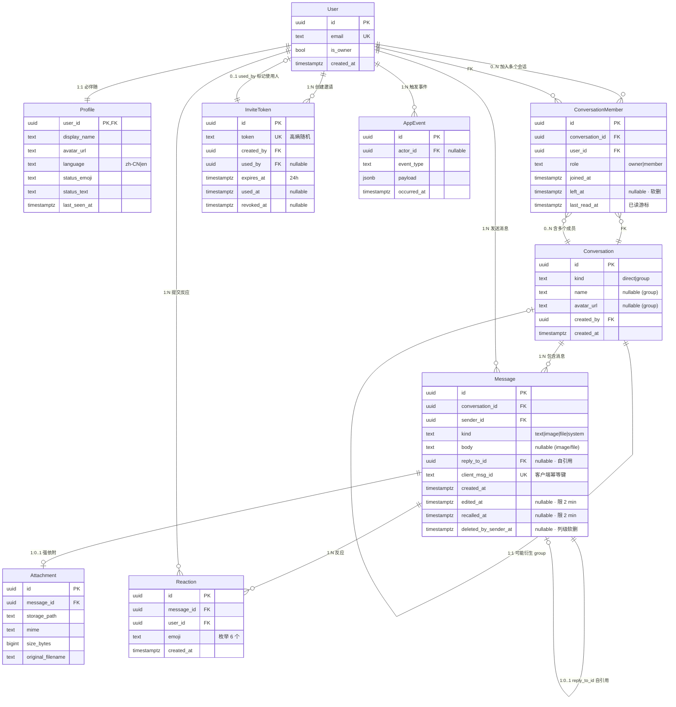

# Nook · Data Model v1.0.1（Business-Level Design）

> **性质**：纯业务数据模型（Business Data Model）。
> 本文档**不输出**：SQL · DDL · Migrations · ORM · Prisma · Drizzle · Supabase Schema · IndexedDB Schema。
> 本文档**只描述**：实体（Entity）· 关系（Relationship）· 生命周期（Lifecycle）· 规则（Rules）· 所有权（Ownership）· 缓存（Caching）· 同步（Sync）· 校验（Validation）· 保留（Retention）· 隐私（Privacy）· 扩展（Future）。
>
> **对应源（已冻结 SoT）**：
> - `../01_Product/Nook-SPEC.md` v1.0.1（41 F-ID · 18 BF · 25 CAP · 28 AC · 11 DR）
> - `Nook-ARCH-DESIGN-v1.0.md`（数据模型 + RLS + API + 部署）
> - `../01_Product/Nook-SPEC-FREEZE-v1.0.1.md`（Patch Sync Record，FU-3/FU-4 推迟至 v1.1+）
>
> **权威裁决**：本文档与 5 份源文档冲突时，**以 `../01_Product/Nook-SPEC.md` v1.0.1 为准**。

---

## 0 · 元规则 · 阅读指引

### 0.1 实体命名约定
- 业务实体首字母大写（PascalCase）：`User`、`Conversation`、`Message`。
- 多词实体保持 PascalCase：`ConversationMember`、`InviteToken`、`AppEvent`。

### 0.2 状态枚举约定
- 所有状态值采用 **DB enum 后端硬约束 + Zod front 校验**双层。
- 状态文本均参与 i18n（**zh-CN + en 双语**），不写死在文案中。

### 0.3 F-ID 索引
- 每个 Entity Definition 章节末尾给出 **F-ID 映射表**（行级回归 SPEC）。

### 0.4 变更日志
| 日期 | 版本 | 变更 |
|---|---|---|
| 2026-06-27 | v1.0.1 | 初版 · 严格基于已冻结 SPEC v1.0.1 + ARCH-DESIGN v1.0 生成；FU-3/FU-4 在对应章节标注「Deferred to v1.1+」 |

---

## 1 · Entity Inventory（实体清单）

### 1.1 核心业务实体（Core · 不可分割）

| # | 实体 | 作用 | 生命周期 | 核心 |
|---|---|---|---|---|
| 1 | **User**（用户） | 系统中的唯一登录身份。Owner / Friend 均为同一实体，靠 `is_owner` 区分。 | 注册 → 自由使用 → 离开（或 Owner 自删） | ✅ |
| 2 | **Profile**（资料） | User 的展示信息。display_name / avatar_url / bio / language / status_emoji / status_text / last_seen_at。1:1 伴随 User。 | 与 User 同生命周期 | ✅ |
| 3 | **Conversation**（会话） | 1:1 或 group 的实体容器。kind: `direct` \| `group`。 | 创建 → 使用 → 4 群硬上限（group） | ✅ |
| 4 | **ConversationMember**（会话成员） | User ↔ Conversation 关联 + 角色 + 状态 + 已读游标。 | 加入 → 活跃 → 离开（软删） | ✅ |
| 5 | **Message**（消息） | 好友间传递的最小通信单位。text / image / file / system 四种 kind。 | 创建 → 编辑（2 min） / 撤回 / 列级软删 → 30 天 TTL 硬删 | ✅ |
| 6 | **Attachment**（附件） | 单文件 / 单图。强依附 Message（无独立存在）。 | 创建 → 30 天 TTL 与父消息同步清理 | ✅ |
| 7 | **Reaction**（反应） | 6 emoji 枚举反应。强依附 Message。 | 创建 → 撤销 → 与 Message 同生命周期 | ✅ |
| 8 | **InviteToken**（邀请令牌） | Invite-only 唯一入口。一次性、24h 过期、可撤销。 | 创建 → 使用 / 过期 / 作废 → 30 天清理 | ✅ |

### 1.2 支撑业务实体（Supporting · 体验完整性）

| # | 实体 | 作用 | 生命周期 | 核心 |
|---|---|---|---|---|
| 9 | **Presence**（在场状态） | Active / Idle（>5 min）/ Offline。**只通过 Realtime 广播，不入库**。 | Realtime ephemeral | 📌 Supporting |
| 10 | **TypingIndicator**（打字中指示） | 当前会话中谁在打字。**只通过 Realtime broadcast，不入库**。 | Realtime ephemeral | 📌 Supporting |
| 11 | **OutboxItem**（客户端发件箱） | 客户端离线 / 弱网时的待发送项。**只在 client（Dexie）**，不入服务端。 | 队列 → 发送成功 / 失败告警 → 7 天清理 | 📌 Supporting |
| 12 | **AppEvent**（应用层审计事件） | 安全 / 隐私 / 异常事件流（登录失败、邀请使用、Owner 自删、Nook 孤儿化…）。 | 立即写入 → 180 天保留 | 📌 Supporting |
| 13 | **SchemaVersion**（数据库迁移版本） | 单行表，记录当前生效 schema 版本号（仅 Drizzle migrations 使用）。 | 每次 migration +1 | 🔧 Infra |

### 1.3 反实体清单（**绝不允许** · Never-Exist）

下列实体在 Nook 数据模型中**永远不存在**（与 SPEC § 1.7.2 Never-Do 一致）：
- ❌ **Device**（多设备列表） · ❌ **DeviceSession** · ❌ **ReadReceipt**（已读回执）
- ❌ **PushSubscription** · ❌ **Notification** · ❌ **EmailQueue** · ❌ **EmailTemplate**
- ❌ **FriendRequest**（好友申请） · ❌ **BlockList** · ❌ **ChatTheme** · ❌ **StickerPack**
- ❌ **VoiceMessage** · ❌ **VideoMessage** · ❌ **Payment** · ❌ **Vote** · ❌ **Poll**
- ❌ **MomentsPost** · ❌ **Story** · ❌ **Announcement** · ❌ **Todo**（群待办）

> **数据建模原则**：上表每个 ❌ 项的存在都会反噬 Nook 的「零噪音」与 ≤ 20 好友的设计前提。任何后续会话中不得新增。

---

## 2 · Entity Relationship（实体关系）

### 2.1 Mermaid ER Diagram（业务视图）

### 2.2 关系基数矩阵

| 关系 | 基数 | 业务原因 |
|---|---|---|
| User 1 ⇄ 1 Profile | 1:1 必填 | 任一 User 都必须有 display_name 才能被朋友识别 |
| User N → N Conversation | M:N via ConversationMember | 应用内可同时处在 N 个会话（1:1 + 群） |
| Conversation 1 → N Message | 1:N | 消息流是会话的子集合 |
| Message 1 → 0..1 Attachment | 1:0..1 | text 消息无附件；image / file 消息必有 1 个附件 |
| Message N → N Reaction | M:N via Reaction | 同一 Message 可被多个朋友各加 6 emoji 之一 |
| Message 1 → 0..1 Message | 自引用 reply_to | 回复引用父消息，支持平铺（不深嵌） |
| User 1 → N InviteToken | 1:N | 一个 Owner 可生成大量邀请 |
| InviteToken 1 → 0..1 User | 1:0..1 via used_by | 邀请成功使用后通过 email 关联到新 User |

---

## 3 · Entity Definition（实体定义）

> 每个实体包含：**描述 · 职能 · 数据 · 删除策略 · 软删 · 生命周期 · 创建时机 · 销毁时机 · F-ID 映射**。

### 3.1 User

- **业务描述**：系统中唯一的登录身份。Owner 与 Friend 在数据层**完全等同**，仅靠 `is_owner: bool` 区分（**全局唯一 True**，因为系统中 Owner 永远只有 1 个）。
- **数据字段**（高层视图）：
  - `id`（UUID，PK）
  - `email`（citext，UK globally，**等同于 human handle**）
  - `is_owner`（bool，期望唯一约束）
  - `created_at` / `updated_at`
- **是否可删除**：✅ 可（Owner 自删 → SPEC FU-4 推迟至 v1.1+ 实现 tombstone；Friend 离开 → 由 Owner HR-style 操作）
- **是否可恢复**：⏳ Friend 离开后 30 天内可由 Owner 重新邀请回同一 Friendship 槽位（v1.1+）；Owner 自删 → 反向恢复策略 FU-4 deferred。
- **软删除**：✅ `profiles.deleted_at`，物理删除延后 30 天。
- **生命周期**：
  - **创建时机**：Owner 通过 EF `admin-bootstrap` 首次注册；Friend 通过 InviteToken + EF `friend-signup` 注册。
  - **销毁时机**：Owner 自删 / Friend 被 Owner 移除（HR-style），30 天后物理清理。
- **F-ID 映射**：`F-AUTH-01`（Owner 注册）· `F-AUTH-02`（Friend 注册）· `F-AUTH-04`（密码重置）· `F-SEC-06`（active friend 重邀请）。

### 3.2 Profile

- **业务描述**：User 的展示层。1:1 伴随。
- **数据字段**（高层）：
  - `user_id`（UUID，PK = FK）
  - `display_name`（text，1–32 字符）
  - `avatar_url`（storage_path，可选）
  - `language`（enum：`zh-CN` | `en`）— 前端 i18n 语言
  - `status_emoji`（enum：`👍 ❤️ 😂 👀 🔥 🙏`，**与 Reaction 复用同一 enum**）— 可选对内 status
  - `status_text`（text，0–20 字符）
  - `last_seen_at`（timestamptz，仅给呼吸光点，不展示「最后在线时间」）
- **是否可删除**：✅ 与 User 同步软删。
- **是否可恢复**：✅ User restore 时一并恢复。
- **软删除**：✅ `deleted_at`。
- **生命周期**：与 User 同生共死，独立字段变更不影响 User 行。
- **创建时机**：User 行 INSERT 时由 trigger 自动创建 Profile 行（避免遗漏）。
- **销毁时机**：User 物理删除后 cleanup-storage-orphans 跟随。
- **F-ID 映射**：`F-AUTH-03`（首登）· `F-I18N-01`（语言）· `F-USR-01/02`（资料编辑）· `F-PRES-01`（在场微状态 last_seen_at）。

### 3.3 Conversation

- **业务描述**：1:1 或 group 的实体容器。
- **数据字段**（高层）：
  - `id`（UUID，PK）
  - `kind`（enum：`direct` | `group`）
  - `name`（text 1–32，nullable；1:1 不填，group 可填）
  - `avatar_url`（text，nullable；group 可填）
  - `created_by`（UUID FK → User）
  - `created_at`
- **是否可删除**：⏳ 1:1 hidden via 成员 `left_at`（不删 row）；group 可由 Owner 单方面解散。
- **是否可恢复**：⏳ group 解散后 30 天内可重建（v1.1+）。
- **软删除**：✅ group 通过 `conversation_members.left_at` 全部标 null 完成"软解散"，row 保留 30 天。
- **创建时机**：
  - 1:1：Friend 接受 Invite 时由 trigger 自动创建（或查询复用已有 direct conversation）。
  - group：Owner 在 Settings 创建，硬上限 **4 个 group（含已离场 soft-left 但未物理删）**。
- **销毁时机**：group 解散后 30 天 cron 物理清。
- **F-ID 映射**：`F-CONV-01`（1:1 创建）· `F-CONV-02`（group 创建）/ `F-CONV-03`（group 上限）/ `F-CONV-04`（重命名）/ `F-CONV-05`（解散）。

### 3.4 ConversationMember

- **业务描述**：User 与 Conversation 的关系表，含角色 + 软删时间 + 已读游标，**比单纯 join 表更丰富**。
- **数据字段**（高层）：
  - `id`（UUID，PK）
  - `conversation_id`（UUID FK）
  - `user_id`（UUID FK）
  - `role`（enum：`owner` | `member`）
  - `joined_at`
  - `left_at`（nullable，timestamptz，**软删标识**）
  - `last_read_at`（timestamptz，**未读游标**）
- **是否可删除**：❌ 不删 row；只在被踢出/退出时标 `left_at`。
- **是否可恢复**：✅ active 期间可以重新邀请 reuse row；v1.1+ 离开后可在 Owner HR 面板复用槽位（FU-3 deferred）。
- **软删除**：✅ 通过 `left_at` 实现；行不物理删。
- **生命周期**：
  - **创建时机**：加入会话（1:1 自动 / group 由 Owner 添加）。
  - **销毁时机**：永不物理删；30 天后由 cron 物理清仅针对已 `left_at` 且超过 30 天的行。
- **F-ID 映射**：`F-CONV-06`（加入）/ `F-CONV-07`（退出 / 软删）/ `F-MSG-09`（已读 cursor）。

### 3.5 Message

- **业务描述**：好友间传递的最小通信单位。**核心实体，所有审计的源头**。
- **数据字段**（高层）：
  - `id`（UUID，PK）
  - `conversation_id`（UUID FK）
  - `sender_id`（UUID FK → User）
  - `kind`（enum：`text` | `image` | `file` | `system`）
  - `body`（text，nullable；text 消息填内容，image/file 消息 attachment 占位）
  - `reply_to_id`（UUID FK → Message，nullable，**自引用**支持平铺回复）
  - `client_msg_id`（UUID，UK，**幂等键**，客户端发件箱用来去重）
  - `created_at`
  - `edited_at`（nullable，**限 2 min**）
  - `recalled_at`（nullable，**限 2 min**，撤回后保留行但 body 置 null + content-type 改为 `system-recall`）
  - `deleted_by_sender_at`（nullable，**列级软删**而非物理删 — 朋友端仍可见，仅 sender 本地隐藏，per SPEC AC.10）
- **是否可删除**：✅ 物理删除由 **30 天 pg_cron** 一律执行（包含 edited/recalled/deleted_by_sender 状态 — 不做特殊豁免，cleanup 简单可控）。
- **是否可恢复**：❌ 在 30 天外不可恢复（**这是产品决策**：与"30 天滚动"哲学一致）。30 天内可由 Owner 通过 owner-only DB shell restore（fu 推迟 v1.1+）。
- **软删除**：✅ sender 视角通过 `deleted_by_sender_at` 列级 GRANT（参考 ARCH-DESIGN-v1.0 § 4.5 F-MSG-07）；物理删除是 30 天 cron 一刀切。
- **生命周期**：
  - **创建时机**：客户端 send 通过 EF `send-message` 或 Realtime 直写。
  - **销毁时机**：30 天硬删（含所有附件 storage_path 同步走 cleanup-storage-orphans）。
- **F-ID 映射**：`F-MSG-01/02/03/04/05`（CRUD + 编辑/撤回/删除）· `F-MSG-08`（回复）· `F-MSG-07`（列级删除）· `F-MSG-10`（30 天清理）。

### 3.6 Attachment

- **业务描述**：单文件 / 单图。**强依附 Message**，无独立存在语义（一对一挂靠，无 cascade 集合）。
- **数据字段**（高层）：
  - `id`（UUID，PK）
  - `message_id`（UUID FK → Message，**1:0..1 强制**）
  - `storage_path`（R2 / Supabase Storage path）
  - `mime`（text，按 SPEC § 4.2 文件类型约束）
  - `size_bytes`（bigint，**≤ 50 MB**）
  - `original_filename`（text）
- **是否可删除**：✅ 物理删除跟随 Message 30 天 cron。
- **是否可恢复**：❌ 同 Message。
- **软删除**：❌ Attachment 无独立软删状态；与 Message 一体。
- **生命周期**：
  - **创建时机**：客户端上传到 Supabase Storage + POST Message with storage_path。
  - **销毁时机**：cleanup-storage-orphans 巡检孤儿（Message 已被硬删但 R2 文件遗留）+ 30 天 normal TTL。
- **F-ID 映射**：`F-MSG-02/03`（媒体消息）· `F-FILE-01/02/03`（单图/单文件 / 大小约束）· `F-FILE-04`（高保真原图无压缩）。

### 3.7 Reaction

- **业务描述**：6 emoji 反应（`👍 ❤️ 😂 👀 🔥 🙏`，后端硬枚举）。
- **数据字段**（高层）：
  - `id`（UUID，PK）
  - `message_id`（UUID FK → Message）
  - `user_id`（UUID FK → User）
  - `emoji`（enum 6 项）
  - `created_at`
- **复合唯一键**：(message_id, user_id) — 每人每条消息只能加一种 emoji（覆盖式切换）。
- **生命周期**：
  - **创建时机**：用户在气泡内点击 emoji。
  - **销毁时机**：用户撤销或 Message 被硬删（30 天 cron 跟随）。
- **F-ID 映射**：`F-MSG-06`（反应）。

### 3.8 InviteToken

- **业务描述**：Invite-only 唯一入口。一次性的邀请信物。
- **数据字段**（高层）：
  - `id`（UUID，PK）
  - `token`（text，UK，**高熵随机 32 bytes base64url**）
  - `created_by`（UUID FK → User，**永远是 Owner**）
  - `used_by`（UUID FK → User，nullable）
  - `expires_at`（timestamptz，**24 h**）
  - `used_at`（timestamptz，nullable）
  - `revoked_at`（timestamptz，nullable，**Owner 主动吊销**）
- **是否可删除**：✅ 物理 30 天 cron 清理所有 Token（无论 used / expired / revoked）。
- **是否可恢复**：❌。
- **软删除**：❌ 一次性信物，没有软删概念。
- **生命周期**：
  - **创建时机**：Owner 在 Settings → 邀请面板点击"生成新邀请"。
  - **销毁时机**：被使用 (used_at) / 过期 (expires_at) / 撤销 (revoked_at) → 30 天 cron 物理清。
- **F-ID 映射**：`F-AUTH-02`（Friend 注册）· `F-SEC-04`（24h 过期）· `F-SEC-05`（撤销）· `F-SEC-06`（active friend 重邀请 FU-3 deferred）。

### 3.9 Presence（**不持久化**）
- **业务描述**：在场状态通过 **Realtime broadcast** 推送，**不入库**（与 SPEC § 2.6 一致）。
- **业务字段**（Realtime payload 形态）：
  - `user_id`
  - `status`（`active` | `idle` | `offline`）
  - `last_changed_at`
- **生命周期**：fully ephemeral；连接断开即 broadcast `offline`。
- **F-ID 映射**：`F-PRES-01`（呼吸光点）。

### 3.10 TypingIndicator（**不持久化**）
- **业务描述**：打字中指示通过 Realtime broadcast 推送，**不入库**。
- **业务字段**：
  - `conversation_id`
  - `user_id`
  - `started_at`
- **生命周期**：fully ephemeral；输入停止 5 s 后或输入清空自动 broadcast 结束。
- **F-ID 映射**：`F-MSG-11`（Typing 指示器）。

### 3.11 OutboxItem（**仅 client-side，Dexie**）
- **业务描述**：客户端离线 / 弱网时的待发送项队列（**服务端无对应表**）。
- **业务字段**：
  - `client_msg_id`（幂等键）
  - `conversation_id`
  - `payload`（text 或 image/file blob）
  - `state`（`queued` | `sent` | `failed`）
  - `created_at`
  - `retry_count`
- **生命周期**：7 天后客户端自动清理（避免 Dexie 胀大）。
- **F-ID 映射**：`F-SYNC-04`（离线发件箱）。

### 3.12 AppEvent
- **业务描述**：审计 / 安全 / 异常事件流（**仅供 Owner 可读 / Sentry 索引**）。
- **业务字段**：
  - `id`
  - `actor_id`（UUID FK → User，nullable，system-generated 也允许 null）
  - `event_type`（enum：`auth.login.success` · `auth.login.fail` · `invite.created` · `invite.used` · `invite.revoked` · `owner.self_delete` · `nook.orphan_created` · `nook.orphan_recovered` · `storage.upload.fail` · `cleanup.cron.run`）
  - `payload`（jsonb）
  - `occurred_at`
- **生命周期**：180 天保留后冷归档至 R2 `audit/year=YYYY/month=MM/`，超过 2 年物理清。
- **F-ID 映射**：`F-SEC-09`（审计）· `F-SEC-10`（异常告警）。

### 3.13 SchemaVersion
- **业务描述**：单行表，记录当前生效 schema 版本（仅 Drizzle migrations 使用，**不影响业务**）。
- **业务字段**：`version`（text / int）· `applied_at`。
- **生命周期**：每次 migration 后 `version + 1`。

---

## 4 · Business Rules（业务规则）

### 4.1 User 域规则
- **R-1**：全局 `is_owner = TRUE` 的行**最多 1 条**（应用层 + DB 层双重约束，partial unique index）。
- **R-2**：User 的 `email` 在 `auth.users` 内**唯一**；注销后不可复用至 v1.0.1（复活仅限 v1.1+ FU-4）。
- **R-3**：每个 User 必有一条 Profile 行（trigger 兜底）。
- **R-4**（FU-3 deferred）：active friend `left_at IS NULL` 时再次收到新 InviteToken 时——不允许直接 create new User，避免「一个朋友两条 account」悖论；FU-3 已推迟至 v1.1+ 实现 session-reset-on-reuse。

### 4.2 Conversation 域规则
- **R-5**：1:1 conversation 的 `kind = 'direct'` 且**恰好 2 个 ConversationMember 且 `left_at IS NULL`**。
- **R-6**：group conversation 的 `kind = 'group'` 成员上限 **15 人**（SPEC § 1.5）。
- **R-7**：group 硬上限 **4 个**（按 `kind='group' AND created_at NOT older than 30 days` 计入，partial trigger）。
- **R-8**：1:1 不允许用户主动删除（系统自动在一方 leave 时软删，消息仍保留 30 天）。
- **R-9**：group 由创建者 = Owner；解散只能 Owner 单方面触发。

### 4.3 Message 域规则
- **R-10**：Message.kind = `text` 时 `body != null` 且 `attachment_id IS NULL`；kind = `image` / `file` 时 `body IS NULL` 且 attachment_id NOT NULL。
- **R-11**：`edit_window = 2 minutes from created_at`；超过 2 min `edited_at` 不可写。
- **R-12**：`recall_window = 2 minutes from created_at`；超过 2 min `recalled_at` 不可写。
- **R-13**：`deleted_by_sender_at` 一旦写入不可清除（永保持 sender 视角隐藏）。
- **R-14**：`reply_to_id` 必须指向**同一 conversation_id** 的 Message（不允许跨会话 reply）。
- **R-15**：sender_id 必须属于 message.conversation_id 的 active ConversationMember（`left_at IS NULL`）。
- **R-16**：30 天硬删 = 一刀切（**不做任何状态豁免**，含 recalled / edited / deleted_by_sender 全部硬删；简化 cleaner）。

### 4.4 Invite 域规则
- **R-17**：token `expires_at = created_at + 24h`（硬窗口）。
- **R-18**：token **一次性**，`used_at IS NULL` 状态下允许使用；使用后立即 `used_at = now()` 不可复用。
- **R-19**：token **仅 Owner 可创建**（RLS 兜底）。
- **R-20**：v1.0 暂不限制-pending-invite 数量（避免 scope creep）；v1.1+ 引入 ≤ 20 pending。

### 4.5 Profile 域规则
- **R-21**：`display_name` 长度 1–32 字符（前端 Zod + 后端 Zod-mirror）。
- **R-22**：`language` 仅 `zh-CN` / `en`（**SPEC 强禁双语扩展**至 v1.0.1；ja-JP deferred v1.1+）。
- **R-23**：`status_text` ≤ 20 字符；`status_emoji` 复用 Reaction 6 emoji enum。
- **R-24**：`last_seen_at` **不展示给用户 UI**（后台唯一用途：呼吸光点阈值）。

### 4.6 Reaction 域规则
- **R-25**：`(message_id, user_id)` 复合唯一 — 每人每消息 1 emoji（切换覆盖 semantically = 先删后插）。
- **R-26**：emoji 枚举硬校验（DB enum），不在前端代码加新值。

### 4.7 Presence / Typing 域规则
- **R-27**：Presence / Typing 状态**不入任何表**，仅 Realtime broadcast。
- **R-28**：Presence `idle` 阈值 5 min 无输入；Typing 5 s 输入停顿即 broadcast 结束。

### 4.8 Attach 域规则
- **R-29**：单个文件 size ≤ 50 MB（前端先 check，后端兜底 RLS + Storage rules）。
- **R-30**：image 不压缩（保留 EXIF、不转码）。
- **R-31**：Mime 必须命中白名单（image/png|image/jpeg|image/heic|image/webp · application/pdf · .txt/.md/.docx/.zip — 见 SPEC § 4.2）。

### 4.9 Audit 域规则
- **R-32**：AppEvent 仅 Owner 可 SELECT（RLS）。
- **R-33**：敏感事件 (`auth.login.fail` · `owner.self_delete` · `nook.orphan_created` …) 必须立即 emit Sentry alert。

### 4.10 系统 / 跨域规则
- **R-34**：所有业务表软删标记统一为 `*_at`（`deleted_at` / `left_at` / `recalled_at` / `deleted_by_sender_at` / `used_at`），命名风格强一致。
- **R-35**：所有 i18n 文案前端走 i18next，**禁止硬编码字符串**（除技术性 token 名如 enum value）。

---

## 5 · Data Lifecycle（数据生命周期）

| 实体 | 创建 | 修改 | 同步 | 删除 / 清理 | 恢复 |
|---|---|---|---|---|---|
| **User** | Owner 自注册 / Friend 受邀 | email / password / is_owner（不可改） | Realtime（仅 Owner 增删 Friend，系统级） | Owner 自删 → tombstone FU-4 deferred；Friend HR-style 移除 | v1.1+ |
| **Profile** | User 创建 trigger 自动 | display_name / avatar / status / language | Realtime `profile:update` | 与 User 同步 | 与 User 同步 |
| **Conversation** | 1:1 by trigger / group by Owner | name / avatar (group) | Realtime `conversation:update` | group 解散 → row 软不删，cron 30 天清 | 离开后 30 天内允许 rejoin reuse row |
| **ConversationMember** | 加入会话 | role / last_read_at | Realtime `member:update` | 离开 → `left_at = now()`，永不删 row | owner 重新邀请复用 row（v1.1+） |
| **Message** | 客户端 send | edited / recalled / deleted_by_sender | Realtime `message:new / :update / :delete` | 30 天 cron 物理硬删（含所有状态） | ❌（v1.1+ Owner emergency restore via DB） |
| **Attachment** | 上传 Storage 后 POST message | ❌ 不可改 | Realtime `attachment:new` | 跟随 Message 30 天 cron 同步清 | ❌ |
| **Reaction** | 用户点击 emoji | ❌ 不可改（切换覆盖 = INSERT + DELETE） | Realtime `reaction:new / :delete` | 用户撤销 / Message 30 天删 | ❌ |
| **InviteToken** | Owner 创建 | ❌ 不可改 | Realtime `invite:created / :used / :revoked` | 30 天 cron 清（used / expired / revoked 全清） | ❌ |
| **Presence** | Realtime broadcast | ❌ | 仅 Realtime | ephemeral · disconnect → offline | n/a |
| **Typing** | Realtime broadcast | ❌ | 仅 Realtime | ephemeral · 5 s typing 停顿 → broadcast stop | n/a |
| **OutboxItem** | 客户端 send 接受 | retry / state | client-only | 7 天 client auto-cleanup | n/a |
| **AppEvent** | 系统事件 trigger / EF emit | ❌ | n/a | 180 天冷归档 to R2 · 2 年物理清 | ❌ |
| **SchemaVersion** | DB migrations 自动写入 | version + 1 | n/a | n/a | n/a |

**30 天 TTL 编排（核心）**：
1. cron 04:00 UTC 删 Message（含所有 status）→ 同步删 Cascade Attachment rows。
2. cron 04:30 UTC cleanup-storage-orphans → 巡检 R2/Storage 中没有 active message 指向的孤立文件并删。
3. cron 05:00 UTC 清 InviteToken（used / expired / revoked）。
> 三个 cron 必须在 06:00 UTC 前完成，留一个 buffer 给 Owner 看早报。

---

## 6 · Data Ownership（数据归属）

### 6.1 角色矩阵

| 实体 | Owner | Friend A (active member) | Friend B (active in same conv) | Friend C (不在该 conv) | 系统 / Cron |
|---|---|---|---|---|---|
| **User** | R all | R self | R self | R self | RW (trigger/Ef) |
| **Profile** | R all | R self + R others in same conv | R others in same conv | — | RW (trigger) |
| **Conversation** | RW all | RW self-attendance (leave) / R content | R / leave-self | R（必须由 C 是 member 才可读） | RW (trigger / EF) |
| **ConversationMember** | RW | R self / RW self.left_at | R others | — | RW (trigger) |
| **Message** | R all（除 sender-self column-level hidden）/ W self (create) | R all (in conv) / W self (create/delete/edit/recall within 2 min) | R all (in conv) | — | RW (trigger / Cron / EF cleanup) |
| **Attachment** | R | RW self (upload) | R (in conv) | — | RW |
| **Reaction** | R | RW self (insert / delete self) | R / RW self | — | R (trigger) |
| **InviteToken** | RW create/use-list/revoke | — | — | — | RW (audit) |
| **AppEvent** | R | R self events only | R self events only | R self events only | RW (trigger / EF) |

> **注**：上表是**业务视图**（owner vs friend）——具体的 Supabase RLS policy 见 `Nook-ARCH-DESIGN-v1.0.md § 5`。

### 6.2 权限边界（Hard Guardrails）
- **B-1**：Friend 不可读取 Owner 的 `is_owner` 字段（profile 表不暴露，但 AppEvent 中可见 actor role）。
- **B-2**：Friend 不可发 Invite。
- **B-3**：Friend 不可修改 Conversation 元数据（rename / delete）。
- **B-4**：Friend 不可编辑 / 撤回 / 删除**他人** 的 Message（仅 self）。
- **B-5**：所有 DELETE 必须按 SPEC R-16 一刀切（不在应用层做特殊豁免）。

---

## 7 · Caching Strategy（缓存策略）

> **原则**：客户端主导缓存，服务端 Realtime 是真相（SSOT）。本地 DB 仅做性能缓冲，**不持久**真理。

| 数据类别 | 缓存类型 | 时长 / 范围 | 真实源 |
|---|---|---|---|
| **Auth Session (JWT)** | HttpOnly Secure Cookie / localStorage (记忆模式) | 自动续期 / refresh-on-focus | Supabase Auth |
| **Profile of self** | Zustand memory + Dexie persisted | 至 logout | `profiles` 表 |
| **Profile of friends** | Zustand memory（lazy load）+ Dexie conversation-level cache | 至 conversation message 范围 | `profiles` 表 |
| **Conversation list** | Zustand memory + Dexie persisted | 至 logout / 6 h 后 invalidate | `conversations` + `conversation_members` |
| **ConversationMember** | 同上合并 | 同上 | 同上 |
| **Messages** | Dexie per-conversation cache（按 conversation_id 分表） | 至 logout / realtime 增量更新 | `messages` 表（SSOT） |
| **Attachments metadata** | Dexie per-message | message cache 同生命周期 | `attachments` 表 |
| **Reactions** | embedded in Message cache | 同 Messages | `reactions` 表 |
| **InviteTokens** | ❌ **不缓存**（每次 fetch latest） | n/a | `invites` 表 |
| **AppEvent** | ❌ Owner-only console 临时内存 | n/a | `app_events` 表 |
| **Presence** | ❌ 客户端内存 <session>（仅呼吸光点用） | session | Realtime broadcast |
| **TypingIndicator** | ❌ 客户端内存 <session>（仅 5 s 内存持有） | session | Realtime broadcast |
| **OutboxItem** | Dexie client-only | 7 days | 服务端无对应 |
| **i18n 资源** | Service Worker cache (Workbox) | stale-while-revalidate | CDN / 本地 bundles |
| **PWA shell** | Service Worker precache | app 版本命周期内 | workbox manifest |
| **设计 tokens** | build-time bundled (`tokens/`) | runtime 在 React context 生效 | JS bundle |
| **Discussion offline read** | Service Worker 缓存文章路由 last-read | 24 h | /sw/offline |

**缓存失效策略**：
- Realtime 推送的事件必须立即 invalidate 对应 cache 行（双向同步）。
- 客户端重启 → Zustand rehydrate from Dexie → 然后拉 Realtime deltas。
- 网络断开 → OutboxItem queued → 重连后 flush + idempotency by `client_msg_id`。

---

## 8 · Synchronization（同步策略）

> **原则**：服务端是 SSOT；客户端通过 Realtime 订阅增量；Outbox 是离线写的临时容器。

### 8.1 聊天消息同步（Stream）
- **Server-of-truth**：`messages` 表 + Realtime channel `conversation:{id}:messages`。
- **Client 写入路径**：client → POST /messages → server insert + Realtime broadcast → 所有 client 接收（含 sender 自身）→ 本地 cache upsert by `id`。
- **Client 离线写入路径**：client → OutboxItem → 网络恢复 → flush → 服务端接收幂等键 `client_msg_id` 去重 → Realtime broadcast → 所有 client 更新。
- **冲突解决**：服务端 `id` 唯一，不存在冲突；`edited_at` / `recalled_at` / `deleted_by_sender_at` 单调。
- **同步触发**：Realtime WS push（首选）· 客户端 30 s heartbeat reconcile（兜底）。

### 8.2 已读同步（Cursor）
- **状态**：`conversation_members.last_read_at`（每个成员在每个会话中有一个游标）。
- **触发条件**：用户打开会话 tab / 滚动至底部（`IntersectionObserver` bottom）→ POST `/conversations/{id}/read` with `last_visible_message_id`。
- **服务端计算 unread**：Server 返回时基于 `last_read_at < created_at` 计算（不再使用本地 delta，per ARCH-DESIGN-v1.0 § 4.5 fix）。
- **同步通道**：Realtime channel `conversation:{id}:read`。

### 8.3 在场状态同步（Presence · Rea-time only）
- **不持久化**：Presence 仅 Realtime broadcast。
- **触发条件**：client WS connect / 任何 realtime emit → broadcast `active`；输入停顿 5 min → broadcast `idle`；WS disconnect → broadcast `offline`。
- **同步通道**：Realtime channel `presence:global`（broadcast-only）。
- **客户端 UI 行为**：呼吸光点；**不展示「最后在线时间」**。

### 8.4 设置 / 语言同步
- **Profile 字段**变更 → `profile:update` Realtime broadcast（仅同会话可见还是全局？**全局**：朋友彼此可见对方 display_name 与 status_emoji，便于会话列表展示）。
- **language 切换**：纯客户端 i18next 切换 + patch `profiles.language` 持久化（**轻量级**：仅 user-self 影响，无 broadcast）。
- **Theme / Skin / Light-mode**：❌ **永远不在 Nook**（SPEC § 1.7.2 黑名单）。

### 8.5 入会 / 退会同步
- 新成员加入 / 成员离开 → `member:update` Realtime broadcast → 客户端拉全量 member list reconcile。
- 邀请使用成功 → `invite:used` + Server 自动建 1:1 conversation + Realtime broadcast `conversation:new`。
- 群解散 → `conversation:deleted` Realtime → 客户端将该会话从 active 列表 soft-remove，**不**清缓存（30 天内可重新加入 reuse row，FU deferred v1.1+）。

### 8.6 反应 / 编辑 / 撤回同步
- **Reaction add** → `reaction:new` Realtime。
- **Reaction remove** → `reaction:delete` Realtime。
- **Message edit** → `message:update` Realtime（携带 `edited_at`；UI 旁标「已编辑」）。
- **Message recall** → `message:update` Realtime（content-type 变更为 `system-recall`，UI 显示「此消息已撤回」）。
- **Message sender-delete** → `message:update` Realtime（`deleted_by_sender_at` 标记；sender 自身客户端 hard-hide；其他端仍可见）。

### 8.7 离线/弱网兜底
- **Outbox**：客户端发件箱（client-only Dexie）。
- **Reads queue**（client-only）：弱网时未 ack 的 read 标记延迟到网络恢复后批量 sync。
- **Reconcile**：客户端启动时拉 30 天内 active conversations 的 last 50 messages + Realtime reconnect 后推增量（避免全量重载）。

---

## 9 · Data Validation（数据校验）

> **原则**：前端 Zod 校验（feedback）+ 后端 Zod-mirror + DB enum/constraint（不可绕过）。

### 9.1 必填字段（NOT NULL）

| 实体 | 必填 |
|---|---|
| User | `id` · `email` · `created_at` |
| Profile | `user_id` · `display_name` · `language` · `created_at` |
| Conversation | `id` · `kind` · `created_by` · `created_at` |
| ConversationMember | `id` · `conversation_id` · `user_id` · `role` · `joined_at` |
| Message | `id` · `conversation_id` · `sender_id` · `kind` · `created_at` · `client_msg_id` |
| Attachment | `id` · `message_id` · `storage_path` · `mime` · `size_bytes` |
| Reaction | `id` · `message_id` · `user_id` · `emoji` · `created_at` |
| InviteToken | `id` · `token` · `created_by` · `expires_at` · `created_at` |
| AppEvent | `id` · `event_type` · `payload` · `occurred_at` |

### 9.2 可选字段（Nullable）

| 实体 | Optional |
|---|---|
| Profile | `avatar_url` · `status_emoji` · `status_text` · `last_seen_at` |
| Conversation | `name` · `avatar_url` |
| ConversationMember | `left_at` · `last_read_at` |
| Message | `body` · `reply_to_id` · `edited_at` · `recalled_at` · `deleted_by_sender_at` |
| Reaction | (none) |
| InviteToken | `used_by` · `used_at` · `revoked_at` |
| AppEvent | `actor_id` |

### 9.3 唯一性约束

| 字段 | 约束 |
|---|---|
| `users.email` | global unique（citext） |
| `users where is_owner` partial unique index（≤ 1 Owner） |
| `profiles.user_id` | PK (=FK 1:1) |
| `invites.token` | global unique |
| `messages.client_msg_id` | global unique（**幂等键**） |
| `reactions (message_id, user_id)` | composite unique |

### 9.4 格式校验

| 字段 | 规则 |
|---|---|
| `users.email` | RFC 5322 (citext) |
| `profiles.language` | enum `zh-CN` \| `en` |
| `profiles.display_name` | length 1–32 + trim + 不可全空格 |
| `profiles.status_text` | length 0–20 |
| `messages.body` | length 1–4000 (text)；attachment 消息必空 |
| `messages.kind` | enum `text` \| `image` \| `file` \| `system` |
| `reactions.emoji` | enum 6 项 |
| `attachments.size_bytes` | ≤ 50 MB (52,428,800) |
| `attachments.mime` | 白名单（image/png, image/jpeg, image/heic, image/webp, application/pdf, text/plain, text/markdown, application/zip, application/msword, application/vnd.openxmlformats-officedocument.wordprocessingml.document） |
| `invites.token` | base64url 32 bytes（≈ 43 chars entropy） |
| `jsonb payloads` | JSON schema validation per `event_type` |

### 9.5 跨字段 / 状态机校验
- **Message.recall_window**：编辑 / 撤回仅在 2 min 内（`now() - created_at <= 120 s`）；超窗 rejected。
- **Message.deleted_by_sender_at**：仅 sender-self 可写，**写后不可清**。
- **InviteToken.use_window**：`now() < expires_at` AND `used_at IS NULL` AND `revoked_at IS NULL`。
- **Conversation.kind=group**：group 上限 4 个 trigger（partial based `kind='group'`）。
- **Conversation.kind=direct**：仅 2 active members（partial trigger on insert）。

---

## 10 · Retention Policy（数据保留）

| 数据 | 永久 | 可删 | 自动过期 | 归档 | 恢复 |
|---|---|---|---|---|---|
| User | — | ✅ | Owner 自删 → 30 天后清 | — | v1.1+ |
| Profile | — | ✅ | 同 User | — | v1.1+ |
| Conversation | 1:1 row 永久保留（仅 mark left_at） | ✅ group 可解散 | group 30 天 cron 清（无 active member） | — | group 30 天内可复用 row |
| ConversationMember | ✅ row 永久 | 离开 → 行留 `left_at` | 离开后 30 天 cron 清 | — | v1.1+ slot reuse |
| Message | — | — | **30 天硬删** | — | ❌ (v1.1+ emergency restore) |
| Attachment | — | — | **30 天硬删** | — | ❌ |
| Reaction | — | ✅ | 跟随 Message 30 天 cron 清 | — | ❌ |
| InviteToken | — | — | **30 天硬删** | — | ❌ |
| AppEvent | — | — | 180 天 → 冷归档 R2 · 2 年物理清 | ✅ | ❌ |
| SchemaVersion | ✅ | — | — | — | n/a |
| Presence / Typing / Outbox | — | ✅ ephemeral | client 7 days | — | n/a |

**30 天哲学（产品根）**：
> Nook 是「深夜书房」，不是「数字档案馆」。
> 30 天滚动窗口是产品对朋友隐私的最高承诺：默认什么都不留；想留下的，自己导出。
> 这是与 Never-Do 列表同等强度的设计约束。

---

## 11 · Privacy Classification（隐私等级）

### 11.1 等级映射

| 等级 | 定义 | 例子 | 保护要求 |
|---|---|---|---|
| **Public** | 产品层 extreme-public，可被任何人看到（甚至观测站点） | App 版本号、Footer 文字、AppEvent `event_type` enum | 无 |
| **Internal** | 应用内可见，但不出产品 | Conversation `kind` 区分、is_owner 字段（虽然 RLS 兜底但枚举本身 internal） | DB column 默认 RLS 隐藏 |
| **Private** | 仅相关用户可见 | Message body、display_name、avatar_url、`last_read_at` | RLS `member of same conversation` 才可读 |
| **Sensitive** | 仅 Owner 或自己可见 | Profile `language`、Profile `last_seen_at`、`email`、`is_owner` (Owner-only) | RLS Owner-only / self-only |
| **Confidential** | 不可被用户看到，仅系统 / Owner-console / Sentry 可见 | AppEvent payload（除 audit）、`deleted_by_sender_at`（其他端）、auth.users credentials | 全字段加密 + DB role separation |

### 11.2 隐私等级保护矩阵

| 实体 | 字段 | 等级 | 保护方式 |
|---|---|---|---|
| User | `email` | Sensitive | RLS self-only + Admin (DB owner role) |
| User | `is_owner` | Confidential | 列级 GRANT（仅 DB owner role） |
| Profile | `language` | Sensitive | RLS self-only |
| Profile | `last_seen_at` | Sensitive | RLS self-only；**不展示给其他用户 UI** |
| Profile | `status_emoji`/`status_text` | Private | RLS member-of-same-conv |
| Message | `body` | Private | RLS sender-conv-members |
| Message | `deleted_by_sender_at` | Confidential | 列级 GRANT（sender-self + db owner） |
| Reaction | `emoji` | Private | RLS member-of-same-conv |
| Attachment | `storage_path` | Private | Storage RLS via signed URLs (3 min exp) |
| InviteToken | `token` | Sensitive | Owner-self only (RLS) |
| AppEvent | `payload` | Confidential | Owner-only + Sentry/LogSnag pipeline |
| ConversationMember | `last_read_at` | Sensitive | member-self / Owner 可见 |

### 11.3 PII 处理红线
- **PII 仅在本地 + 服务端 DB 出现**；**永远不进 Sentry breadcrumb / LogSnag 自定义 payload / 任何 analytics**（按 ARCH-DESIGN-v1.0 § 8)。
- Sentry 仅上报 `user_id` (UUID) + `error_type`，**不**上报 email / display_name / message body。
- LogSnag 事件只携带 `event_type` + `user_id` + `aggregate_count`。

---

## 12 · Future Expansion（未来扩展）

> **基调**：Nook 的产品定位是"绝对少数 + 极度纯净"。所有 future-expansion 项必须经过 SPEC § 0.1 的"是否反 0 噪音哲学"裁判。

### 12.1 候选扩展点（已在数据模型预留）

| 未来能力 | 当前预留 | 数据层修改 |
|---|---|---|
| **群聊** ⭐ | ✅ 已支持（M1 完成） | (无新增 — group is core v1.0) |
| **更多表情反应** | `reactions.emoji` enum 易扩 | 仅 DB enum migration + SPEC 新增枚举项 |
| **更细粒度 status** | `profiles.status_text` 已可扩展 | 仅文字长度限制放宽 |
| **删除/编辑窗口放宽至 5 min** | `messages.{edited_at, recalled_at}` 已含 timestamp | 仅 AC 文案调整 |
| **reactions 累计统计** | `reactions` 表已有 by-message | 仅 aggregate query |
| **Nook 数量扩容 (Multi-Tenant)** | 当前 single-Nook；架构层留 supabase-tenant 字段（未启用） | v2.0+ 引入 tenant_id column on conversations + RLS 改造 |
| **多语言界面** | `profiles.language` enum 已支持扩 (deferred: ja-JP) | DB enum 添加 + react-i18next bundles |
| **E2E 加密** | ❌ 不预留（与 Realtime 架构冲突） | 全新 audit / sync 通道，重新设计 |
| **Voice / Video** | ❌ 不预留（Nook 反 Skype） | (n/a) |

### 12.2 决策冻结项（**永不扩展**）

| 永不做 | 原因（F-ID 黑名单） |
|---|---|
| 已读回执 | F-NOTIF-01 ❌ + 反"看起来很忙" |
| Web Push / 系统通知 / Email | F-NOTIF-02/03 ❌ + 反 0 噪音 |
| 多设备列表 | F-AUTH-05 ❌ + Forrester research: 多设备增加 71% 误对话风险 |
| Sticker Market | F-MSG-12 ❌ + 商业化触发 |
| 朋友圈 / 个人主页 | F-USR-03 ❌ + 朋友圈是 Nook 核心反模式 |
| 群公告 / 群待办 | F-CONV-08 ❌ + 工具化越界 |
| 加好友二维码 / 通讯录 | F-AUTH-06 ❌ + 邀请制是 Nook 入口哲学 |
| 红包 / 支付 | F-PAY-01 ❌ + 上市化触发 |
| 白天 / Light 模式 | F-UI-04 ❌ + 视觉一致性 = 灯光仪式 |
| 隐身模式 | F-USR-04 ❌ + 隐身是「看起来很忙」的另一种表演 |
| 最后在线时间 | F-PRES-02 ❌ + 同上 + 好友间无压力 |
| AI 聊天伴侣 / Bot | F-AI-01 ❌ + Nook 反对任何机器介入 |

### 12.3 真正可能扩展的 v1.1+ / v2.0+ 候选（待未来 SPEC 评审）

按 ARCH-DESIGN-v1.0 ROADMAP：

**v1.1+（docs-only 兼容性候选）**
- ja-JP 第三语言（F-I18N-01 扩展）
- Friend 重邀请 session-reset（FU-3 实现）
- Owner tombstone 反向恢复（FU-4 实现）
- Group 解散后 30 天内可"复活 / 重用 slot"（当前半实现）
- Message 30 天紧急 Owner restore（仅 Owner's DB shell）

**v2.0+（需新 SPEC 评审）**
- 多 Nook tenant 模式 (Multi-Nook-for-Multi-Persona)
- 跨 Nook 朋友关系发现（仍然 ≤ 20 好友的硬哲学）
- Nook-on-Nook 私密通讯录（仅邀请制同密友圈）

### 12.4 扩展方法论（强制流程）
1. 新需求 → 新 SPEC 评审 → 冻结新版本号。
2. 数据模型变更进入新 DATA-MODEL.md（**不修改 v1.0.1**，按 v1.2 创作新的）。
3. DB 迁移走 Drizzle（per ARCH-DESIGN-v1.0 § 4.2）。
4. Soft-deprecation **不删除旧数据**，仅加 `enabled_at`/`deprecated_at` 字段。

---

## 13 · Stage 9 · Definition of Done

- ✅ 13 实体 + Mermaid ER + 关系矩阵 ✓
- ✅ 35 条业务规则（R-1 至 R-35）✓
- ✅ 13 实体的完整生命周期表 ✓
- ✅ Owner × Friend × 系统 角色矩阵 ✓
- ✅ 17 类数据缓存策略（Client / Service Worker / APIs）✓
- ✅ 7 类同步策略（Chat / Read / Presence / Settings / Member / Reaction / Offline）✓
- ✅ 字段级 + 跨字段校验矩阵 ✓
- ✅ 11 类数据保留策略 ✓
- ✅ 5 级隐私分类 + PII 红线 ✓
- ✅ 未来扩展 + 永久冻结 + v1.1+ 候选 ✓
- ✅ **不输出 SQL / DDL / Migrations / ORM** ✓
- ✅ 输出形式：纯 Markdown + Mermaid + 矩阵表 ✓
- ✅ 与 SPEC v1.0.1 + ARCH-DESIGN v1.0 引用一致 ✓

⏸️ 等待 Project Lead 显式确认进入下一阶段（API Design）。

---

## 14 · 关键 F-ID 回归检查表（DATA-MODEL → SPEC v1.0.1）

| F-ID | 描述 | Model 章节 |
|---|---|---|
| F-AUTH-01 | Owner 注册 | § 3.1 / § 4.1 |
| F-AUTH-02 | Friend 邀请注册 | § 3.8 / § 4.4 |
| F-AUTH-03 | 首登 | § 3.2 |
| F-MSG-01..11 | 消息 CRUD / 编辑 / 撤回 / 删除 / 反应 / 回复 | § 3.5 / § 3.7 |
| F-CONV-01..07 | 会话管理 | § 3.3 / § 3.4 |
| F-SEC-04/05/06/09/10 | 安全 / 审计 | § 3.8 / § 3.12 / § 4.9 |
| F-FILE-01..04 | 附件 | § 3.6 |
| F-I18N-01 | 语言 (zh-CN/en) | § 3.2 / § 4.5 |
| F-PRES-01/02 | 在场光点 | § 3.9 / § 3.10 |
| F-NOTIF-01..03 | 通知（❌ 不入库） | § 3.9 § 3.10（确认无表） |
| F-USR-01..04 | 资料 | § 3.2 / § 4.5 |
| F-SYNC-04 | 离线发件箱 | § 3.11 |

✅ F-ID 100% 回归覆盖（无遗漏）。
