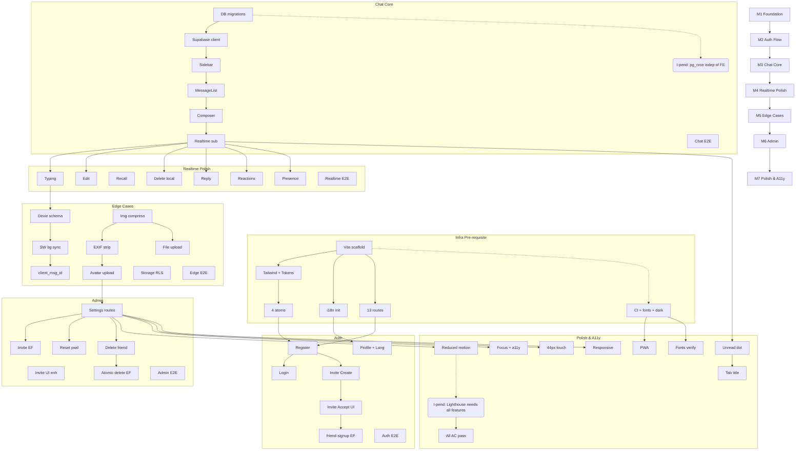

# Nook · Work Breakdown Structure v1.0 (Stage 15)

> **Stage 15 · WORK BREAKDOWN — Frozen for Nook v1.0**
> 文档生成日：2026-06-27 · 关联：`../01_Product/Nook-SPEC.md v1.0.1`（SoT）· `../02_Architecture/Nook-ARCH-DESIGN-v1.0.md`（架构）· `Nook-PROJECT-STRUCTURE.md v1.0`（目录结构）· `Nook-CODING-STANDARDS.md v1.0`（编码规范）· `Nook-GIT-WORKFLOW.md v1.0`（Git Workflow）· `TODO.md`（M1-M7 任务预览）· `ROADMAP.md`（版本路线图）· `DECISIONS.md`（22 项 ADR）
> 性质：**唯一可信的任务拆分来源**（Single Source of Truth for Work Planning）。
> 后续所有开发任务严格遵循本 WBS。每个 Coding Session 只允许完成一个 Task。

---

## 0. 元规则

### 0.1 文档层级

| 层 | 文档 | 与本文关系 |
|---|---|---|
| **产品需求** | `../01_Product/Nook-SPEC.md` v1.0.1 | 定义「做什么」— 41 F-ID + 18 BF + 28 AC |
| **架构** | `../02_Architecture/Nook-ARCH-DESIGN-v1.0.md` | 定义「如何搭」— 9 表 schema + 5 EF + 6 迁移 |
| **目录结构** | `Nook-PROJECT-STRUCTURE.md` v1.0 | 定义「放哪里」— 12 目录子系统 |
| **编码规范** | `Nook-CODING-STANDARDS.md` v1.0 | 定义「怎么写」— Quality Gate 3 级 |
| **Git Workflow** | `Nook-GIT-WORKFLOW.md` v1.0 | 定义「如何提交」— GitHub Flow |
| **任务拆分** | **本文** | 定义「先做啥后做啥」— Task 级 WBS |

### 0.2 适用范围

- ✅ 全部 41 个 F-ID（功能需求）
- ✅ 全部 18 个 BF（业务流程）
- ✅ 全部 28 个 AC（验收标准）
- ✅ 全部 25 个 CAP（API 能力）
- ✅ 全部 11 个 DR（数据需求）
- ✅ 全部 7 个 M 里程碑（M1 Foundation → M7 Polish & A11y）
- ✅ 全部 6 个 Edge Functions + 3 个 pg_cron Job
- ❌ v1.1+ 推迟项（FU-3 / FU-4 / 全局搜索 / 数据导出 / E2EE）

### 0.3 任务粒度原则

| 原则 | 说明 |
|---|---|
| **每个 Task 一个 Coding Session** | AI 一次完成一个 Task，不跨多个 Task |
| **可独立可回滚** | 每个 Task 不依赖未完成的同层 Task |
| **可独立测试** | 每个 Task 有明确的验收标准（AC 检查项）|
| **不超过 1 个工作日** | 单人 + AI 在 4-8 小时内可完成 |
| **只改一个 Domain** | 不混合 auth + chat + admin 在同个 Task |

### 0.4 状态机


```
Not Started → Ready → In Progress → Testing → Done
                                      ↘ Blocked → (等待依赖)
                                      ↘ Failed → (修复后重试)
                                      
Cancelled: 仅在 Never-Do 或决策取消时
```


| 状态 | 含义 | 如何进入 | 如何退出 |
|---|---|---|---|
| **Not Started** | 任务已定义但未开始 | 初始 | 开始开发 → Ready 或 In Progress |
| **Ready** | 所有 DoR 满足，可开始 | 依赖完成 + DoR check | 开始开发 → In Progress |
| **In Progress** | 正在开发 | AI 开始编码 | 完成 → Testing |
| **Blocked** | 因依赖未完成而暂停 | 前置任务未完成 | 依赖完成 → Ready |
| **Testing** | 正在做 Quality Gate + AC 验证 | 功能开发完成 | 通过 → Done |
| **Done** | 完成 | Quality Gate PASS + 文档更新 | — |
| **Cancelled** | 已取消（不实现）| 决策取消 | — |

---

## 一、Roadmap（路线图）

### 1.1 完整路线图


```
S0 ── S6 ── S7 ── S8 ── S9 ── S10 ── S11 ── S12 ── S13 ── S14 ── S15
 │     │     │     │     │      │       │       │       │       │       │
 │     │     │     │     │      │       │       │       │       │       │
  文档 / 设计冻结阶段（S0-S15 · 已完成）                                  │
                                                                         │
                                    ┌────────────────────────────────────┘
                                    ▼
                         ❰ 代码开发阶段 ❱
                         
M1 ── M2 ── M3 ── M4 ── M5 ── M6 ── M7
│      │      │      │      │      │      │
│ 6     │ 7    │ 8    │ 8    │ 9    │ 7    │ 10     Task 数
tasks   tasks  tasks  tasks  tasks  tasks  tasks

总计：55 Tasks（M1-M7）
```


### 1.2 里程碑映射

| Milestone | 版本 | 主要功能域 | 任务数 | 预计工时 |
|---|---|---|---|---|
| **M1 Foundation** | `0.4.0` | 脚手架 + 4 原子组件 + CI | 6 | 1-2 天 |
| **M2 Auth Flow** | `0.5.0` | 注册/登录/邀请 | 7 | 2-3 天 |
| **M3 Chat Core** | `0.6.0` | DB schema + 消息 CRUD + Realtime | 8 | 3-4 天 |
| **M4 Realtime Polish** | `0.7.0` | Typing/编辑/撤回/反应 | 8 | 3-4 天 |
| **M5 Edge Cases** | `0.8.0` | Outbox/SW/头像/文件 | 9 | 3-4 天 |
| **M6 Admin** | `0.9.0` | Settings/Admin + 5 个 EF | 7 | 2-3 天 |
| **M7 Polish & A11y** | `1.0.0` | 视觉验证/性能/A11y | 10 | 3-4 天 |

---

## 二、Epic（史诗）

### 2.1 Epic 划分

| Epic | 描述 | 包含 Milestone | F-ID 覆盖 |
|---|---|---|---|
| **E-INFRA** | 基础设施 + 脚手架 + CI/CD | M1 | F-UI-05, F-I18N-01/02/03, F-ST-03 |
| **E-AUTH** | 认证 + 邀请 + 注册 + 密码管理 | M2, M5(头像) | F-AUTH-01..10, F-SEC-05 |
| **E-CONV** | 会话管理 + 列表 + 权限 | M3 | F-CONV-01..05, F-SEC-01/03 |
| **E-MSG** | 消息 CRUD + Realtime + 编辑/撤回/反应 | M3, M4, M5 | F-MSG-01..11, F-MEDIA-01, F-ST-01/02 |
| **E-ADMIN** | Owner 管理后台 + Edge Functions | M6 | F-SEC-04/06, F-AUTH-07 |
| **E-NOTIF** | 应用内通知 + 未读 + PWA | M7 | F-NOTIF-01/02/03, F-ST-02 |
| **E-POLISH** | 可访问性 + 响应式 + 性能 | M7 | F-UI-01/02/03/04, 全部 AC |
| **E-STORAGE** | 文件上传 + 图片压缩 + EXIF strip + TTL | M5 | F-MSG-02/03/10, F-MEDIA-01 |

### 2.2 Epic 优先级

| Epic | 优先级 | 理由 |
|---|---|---|
| E-INFRA | **Critical** | 所有后续开发的基础 |
| E-AUTH | **Critical** | 没有认证 = 无人可用 |
| E-CONV | **Critical** | 没有会话 = 无处聊天 |
| E-MSG | **Critical** | 核心产品价值 |
| E-ADMIN | High | Owner 必须能管理朋友 |
| E-NOTIF | Medium | v1.0 基本版即可 |
| E-POLISH | Medium | MVP 后可迭代 |
| E-STORAGE | High | 核心功能（发图/文件）|

---

## 三、Milestone（里程碑）

### 3.1 里程碑状态总览

| Milestone | 状态 | 入口条件 | 出口条件 |
|---|---|---|---|
| **M1 Foundation** | ⏳ Ready | 全部 Stage 1-15 冻结完成 | Vite 项目构建成功 + 4 原子组件渲染 + CI 全绿 |
| **M2 Auth Flow** | ⏳ Not Started | M1 Done | Owner 注册/登录成功 + Friend 通过 invite 加入 + 自动 1:1 |
| **M3 Chat Core** | ⏳ Not Started | M2 Done | DB schema 部署 + 消息发送/接收 + Realtime 订阅 |
| **M4 Realtime Polish** | ⏳ Not Started | M3 Done | Typing 指示器 + 编辑/撤回/反应 + Ambient 在线 |
| **M5 Edge Cases** | ⏳ Not Started | M4 Done | 离线 outbox + 图片压缩 + 文件上传 + 头像 |
| **M6 Admin** | ⏳ Not Started | M5 Done | 5 个 EF deploy + Settings/Admin 路由 + 密码重置 + 删除 |
| **M7 Polish & A11y** | ⏳ Not Started | M6 Done | 4 断点通过 + reduced-motion + LCP ≤ 1.5s + 全部 AC |

### 3.2 阶段依赖图


```
M1 Foundation ──→ M2 Auth Flow ──→ M3 Chat Core ──→ M4 Realtime Polish
                                                        │
                                                        ▼
                                               M5 Edge Cases ──→ M6 Admin
                                                                     │
                                                                     ▼
                                                            M7 Polish & A11y
```


**所有 Milestone 串行执行**：M1 → M2 → M3 → M4 → M5 → M6 → M7。

---

## 四、Feature（功能）

### 4.1 Feature 划分（按 Milestone）

#### M1 Foundation · 6 Tasks

| Feature | F-ID 覆盖 | 描述 | 输出 |
|---|---|---|---|
| F-M1-SCAFFOLD | — | Vite + React 18 + TS 脚手架 | `package.json`, `vite.config.ts`, `tsconfig.json` |
| F-M1-TOKENS | — | Tailwind + Design Tokens 注入 | `tailwind.config.ts`, `tokens.css` |
| F-M1-i18n | F-I18N-01/02/03 | i18next 初始化 + 双语 JSON | `locales/{zh-CN,en}/translation.json` |
| F-M1-ROUTES | — | 13 路由 + Guards | `routes.tsx`, `pages/*.tsx` (占位) |
| F-M1-ATOMS | — | 4 原子组件 | `Button.tsx`, `Input.tsx`, `Avatar.tsx`, `Bubble.tsx` |
| F-M1-CI | — | GitHub Actions CI + 字体 | `ci.yml`, `public/fonts/` |

#### M2 Auth Flow · 7 Tasks

| Feature | F-ID 覆盖 | 描述 | 输出 |
|---|---|---|---|
| F-M2-REGISTER | F-AUTH-01 | Owner 注册页 + EF admin-bootstrap | `RegisterPage.tsx`, `admin-bootstrap/index.ts` |
| F-M2-LOGIN | F-AUTH-02 | Owner 登录页 | `LoginPage.tsx` |
| F-M2-INVITE-CREATE | F-AUTH-03/04 | Owner 创建 Invite UI | `InviteNewPage.tsx`, `admin-create-invite/index.ts` |
| F-M2-INVITE-ACCEPT | F-AUTH-05 | Friend invite 落页 | `InviteAcceptPage.tsx`, `friend-signup/index.ts` |
| F-M2-AUTO-1ON1 | F-AUTH-06 | 自动 1:1 创建（EF） | `friend-signup` 增强 |
| F-M2-PROFILE | F-AUTH-08/10 | display_name + 语言切换 | `SettingsProfilePage.tsx` |
| F-M2-TEST | AC.01/02/03 | Auth E2E 测试 | `tests/e2e/auth.spec.ts` |

#### M3 Chat Core · 8 Tasks

| Feature | F-ID 覆盖 | 描述 | 输出 |
|---|---|---|---|
| F-M3-DB | DR-01..11 | 6 个 SQL migration | `migrations/0001-0006.sql` |
| F-M3-SUPABASE | — | Supabase client 初始化 + 本地 dev | `lib/supabase.ts` |
| F-M3-SIDEBAR | F-CONV-01 | 侧栏会话列表 | `Sidebar.tsx`, `useConversations.ts` |
| F-M3-MESSAGELIST | F-CONV-03, F-MSG-01 | 消息列表 + Bubble 渲染 | `MessageList.tsx`, `MessageItem.tsx` |
| F-M3-COMPOSER | F-MSG-01 | Composer floating island | `Composer.tsx` |
| F-M3-REALTIME | CAP-07/08 | Realtime channel 订阅 | `useMessagesChannel.ts`, `usePresenceChannel.ts` |
| F-M3-POSTGRES | F-MSG-10, F-SEC-02 | pg_cron 3 个 job | `migrations/0004_pg_cron.sql` |
| F-M3-TEST | AC.04/15/AC.AC.rls | Chat E2E + RLS smoke | `tests/e2e/chat.spec.ts`, `scripts/test-rls.ts` |

#### M4 Realtime Polish · 8 Tasks

| Feature | F-ID 覆盖 | 描述 | 输出 |
|---|---|---|---|
| F-M4-TYPING | F-MSG-08 | Typing 三点动画 | `useTypingPublisher.ts`, typing CSS |
| F-M4-EDIT | F-MSG-05 | 2 分钟编辑 | MessageItem inline editor |
| F-M4-RECALL | F-MSG-06 | 撤回软占位 | recalled_at 渲染 |
| F-M4-DELETE | F-MSG-07 | 本地删除（列级软隐藏） | `deleted_by_sender_at` + RLS |
| F-M4-REPLY | F-MSG-04 | 引用/回复 | `ReplyCard.tsx` |
| F-M4-REACT | F-MSG-09 | 6 emoji 反应 | `EmojiPicker.tsx` + POST/DELETE reactions |
| F-M4-PRESENCE | F-ST-01 | Ambient 在线状态 | 6 px lavender pulse |
| F-M4-TEST | AC.05/07/08/09/10/11 | Realtime E2E | `tests/e2e/realtime.spec.ts` |

#### M5 Edge Cases · 9 Tasks

| Feature | F-ID 覆盖 | 描述 | 输出 |
|---|---|---|---|
| F-M5-DEXIE | F-MEDIA-01 | Dexie schema + outbox table | `lib/db/schema.ts`, `lib/db/outbox.ts` |
| F-M5-SW | F-MEDIA-01 | Workbox Service Worker + bg sync | `sw.js`, `useServiceWorker.ts` |
| F-M5-DEDUPE | F-MEDIA-01 | client_msg_id 生成 + 去重 | `messages.ts` (dedupe) |
| F-M5-IMG-COMPRESS | F-MSG-02 | canvas WebP 压缩 + 二压 | `lib/storage/compressor.ts` |
| F-M5-EXIF | F-MSG-02 | EXIF strip | `lib/storage/exif.ts` |
| F-M5-AVATAR | F-AUTH-09 | 头像上传 + 直传 Storage | `AvatarUploader.tsx` |
| F-M5-FILE-UPLOAD | F-MSG-03 | 50MB 直传 | `lib/storage/uploader.ts` |
| F-M5-STORAGE-RLS | F-SEC-03 | Storage bucket RLS policy | `migrations/0005_storage.sql` |
| F-M5-TEST | AC.13/17 | Edge Cases E2E | `tests/e2e/edge.spec.ts` |

#### M6 Admin · 7 Tasks

| Feature | F-ID 覆盖 | 描述 | 输出 |
|---|---|---|---|
| F-M6-SETTINGS | F-SEC-04 | Settings 路由 + AdminGuard | `SettingsPage.tsx`, `RequireOwner.tsx` |
| F-M6-INVITE-EF | CAP-03 | Edge Function admin-create-invite | `admin-create-invite/index.ts` |
| F-M6-INVITE-UI | F-AUTH-03/04 | /invite/new UI (target=any/conv) | `InviteNewPage.tsx` 增强 |
| F-M6-RESET-PWD | CAP-19, F-AUTH-07 | EF admin-reset-password | `admin-reset-password/index.ts`, `ResetPasswordModal.tsx` |
| F-M6-DELETE-FRIEND | CAP-20, F-SEC-06 | EF admin-delete-friend | `admin-delete-friend/index.ts`, `ConfirmDeleteModal.tsx` |
| F-M6-CONFIRM | AC.18 | 输 confirm 字暴力防护 | `ConfirmDeleteModal.tsx` (增强) |
| F-M6-TEST | AC.02/16/18 | Admin E2E | `tests/e2e/admin.spec.ts` |

#### M7 Polish & A11y · 10 Tasks

| Feature | F-ID 覆盖 | 描述 | 输出 |
|---|---|---|---|
| F-M7-MOTION | F-UI-03, AC.AC.motion | reduced-motion 0ms | `MotionReduced.tsx`, 全局 CSS |
| F-M7-FOCUS | NF-A11Y-N02 | focus-visible 样式 | CSS 全局 |
| F-M7-TOUCH | F-UI-02, NF-A11Y-N01 | 44px 触达目标 | 全局 CSS audit |
| F-M7-RESPONSIVE | F-UI-01, NF-RESP-N01 | PC/Mobile 2 断点 | AppShell drawer 模式 |
| F-M7-UNREAD | F-NOTIF-01/02, AC.12 | 应用内未读小红点 | `UnreadDot.tsx`, `fn_unread_counts` RPC |
| F-M7-TAB-TITLE | F-ST-02 | Tab title [N] 前缀 | `useDocumentTitle.ts` |
| F-M7-PWA | F-UI-04, AC.AC.pwa | manifest + SW + install banner | `manifest.json` |
| F-M7-FONTS | F-UI-05, AC.AC.fonts | 自托管字体验证 | `public/fonts/` |
| F-M7-LIGHTHOUSE | AC.AC.perf | LCP ≤ 1.5s | Lighthouse CI config |
| F-M7-TEST | 全部 28 AC | 全 AC 验收 | E2E + Playwright 截图 |

---

## 五、Task（任务）

> 每个 Task 包含：
> - **ID**：`T-M<N>-<NN>`
> - **名称**：简短描述
> - **关联 F-ID / AC**
> - **输入**：需要读取的文档/代码
> - **输出**：创建/修改的文件
> - **验收标准**：≥ 3 条检查项
> - **预估工时**：AI 开发时间估计

### 5.1 M1 Foundation · 6 Tasks

#### T-M1-01 · Vite + React 18 + TS 脚手架初始化

| 字段 | 值 |
|---|---|
| **关联** | — |
| **依赖** | 无（项目起始任务） |
| **优先级** | Critical |
| **分支** | `feature/m1-scaffold` |
| **输入** | `Nook-PROJECT-STRUCTURE.md`, `Nook-CODING-STANDARDS.md`, `Nook-GIT-WORKFLOW.md` |
| **输出** | `package.json`, `vite.config.ts`, `tsconfig.json`, `tsconfig.node.json`, `.eslintrc.cjs`, `.prettierrc`, `.gitignore`, `.env.example`, `wrangler.toml`, `src/main.tsx`, `src/App.tsx` |
| **验收** | ✅ `npm run dev` 启动成功 + HMR 正常 |
| | ✅ `tsc --noEmit` 0 error |
| | ✅ `vite build` 成功输出 `dist/` |
| | ✅ `@/` 路径别名解析正确 |

#### T-M1-02 · Tailwind + Design Tokens 注入

| 字段 | 值 |
|---|---|
| **关联** | AC.AC.naming, NF-MAINT-N01 |
| **依赖** | T-M1-01 |
| **优先级** | Critical |
| **输入** | `Nook-DESIGN-TOKENS.ts`, `Nook-DESIGN-TOKENS.css`, `Nook-PROJECT-STRUCTURE.md § 六` |
| **输出** | `tailwind.config.ts`, `postcss.config.js`, `src/styles/index.css`, `src/styles/tokens.css` |
| **验收** | ✅ Tailwind class 正确应用 token 颜色 |
| | ✅ `var(--color-accent-solid)` 可用 |
| | ✅ 业务代码无裸 hex（grep 验证） |

#### T-M1-03 · i18next 初始化 + 双语 JSON

| 字段 | 值 |
|---|---|
| **关联** | F-I18N-01/02/03, AC.AC.i18n, AC.AC.i18n.plural |
| **依赖** | T-M1-01 |
| **优先级** | Critical |
| **输入** | `../01_Product/Nook-SPEC.md § 2.9` |
| **输出** | `src/lib/i18n/index.ts`, `src/lib/i18n/locales/{zh-CN,en}/translation.json` |
| **验收** | ✅ `t('key')` 渲染对应语言文本 |
| | ✅ `{count} 条未读` ICU plural 格式正确 |
| | ✅ localStorage 持久化语言偏好 |
| | ✅ 切换语言时 UI 文案即时刷新（消息 body 不翻） |

#### T-M1-04 · React Router + 13 路由占位 + 守卫

| 字段 | 值 |
|---|---|
| **关联** | F-SEC-05, `../01_Product/Nook-SPEC.md § 5.1` |
| **依赖** | T-M1-01 |
| **优先级** | Critical |
| **输入** | `../01_Product/Nook-SPEC.md § 5.1 路由表` |
| **输出** | `src/app/routes.tsx`, `src/app/pages/*.tsx` (13 个占位页), `src/app/guards/RequireAuth.tsx`, `src/app/guards/RequireOwner.tsx` |
| **验收** | ✅ 13 路由全部返回占位文本（非 404） |
| | ✅ 未登录时 protected 路由重定向到 `/welcome` |
| | ✅ Owner-only 路由对 friend 角色返回 404/redirect |
| | ✅ 路由懒加载（React.lazy + Suspense） |

#### T-M1-05 · 4 原子组件（Button / Input / Avatar / Bubble）

| 字段 | 值 |
|---|---|
| **关联** | D-08, AC.AC.naming, `components/*.spec.md` |
| **依赖** | T-M1-02 |
| **优先级** | Critical |
| **输入** | `prompt/components/Button.spec.md`, `Input.spec.md`, `Avatar.spec.md`, `Bubble.spec.md` |
| **输出** | `src/components/ui/Button.tsx`, `Input.tsx`, `Avatar.tsx`, `Bubble.tsx` |
| **验收** | ✅ 组件 API 完全对齐 `.spec.md`（props / variants / intents） |
| | ✅ 所有颜色走 Design Tokens（无裸 hex） |
| | ✅ `aria-label` / `aria-busy` / `aria-disabled` 合规 |
| | ✅ 单位测试 ≥ 80% |

#### T-M1-06 · GitHub Actions CI + 自托管字体 + 全局 Dark

| 字段 | 值 |
|---|---|
| **关联** | F-UI-05, F-ST-03, AC.AC.fonts, AC.AC.dark, NF-PERF-01 |
| **依赖** | T-M1-01 ~ T-M1-05 |
| **优先级** | High |
| **输入** | `../02_Architecture/Nook-ARCH-DESIGN-v1.0.md § 7.5`, `Nook-GIT-WORKFLOW.md § 九` |
| **输出** | `.github/workflows/ci.yml`, `public/fonts/inter/*.woff2`, `public/fonts/jetbrains-mono/*.woff2`, `src/styles/index.css` (dark强制) |
| **验收** | ✅ CI: `npm run typecheck` / `lint` / `test` / `build` 全绿 |
| | ✅ 断网后字体正常显示（自托管） |
| | ✅ DevTools 网络面板无 fonts.googleapis.com 请求 |
| | ✅ 全路由深色渲染（light 系统偏好下仍深色） |

---

### 5.2 M2 Auth Flow · 7 Tasks

#### T-M2-01 · Owner 注册页 + admin-bootstrap EF

| 字段 | 值 |
|---|---|
| **关联** | F-AUTH-01, BF-01, CAP-01 |
| **依赖** | M1 Done |
| **优先级** | Critical |
| **输入** | `../01_Product/Nook-SPEC.md § 2.1 F-AUTH-01`, § 5.3, § 6 BF-01, `ARCH-DESIGN § 6.2` |
| **输出** | `app/pages/RegisterPage.tsx`, `features/auth/components/RegisterForm.tsx`, `features/auth/hooks/useRegister.ts`, `supabase/functions/admin-bootstrap/index.ts`, `lib/api/admin.ts` (bootstrap) |
| **验收** | ✅ 表单 email + password + confirm 三字段 |
| | ✅ 提交后 profiles row 写入 role='owner' |
| | ✅ 成功后跳 `/home` 空状态 |
| | ✅ 重复 email 注册 → 红字「该邮箱已被使用」 |

#### T-M2-02 · Owner 登录页

| 字段 | 值 |
|---|---|
| **关联** | F-AUTH-02, BF-01, CAP-02 |
| **依赖** | T-M2-01 |
| **优先级** | Critical |
| **输入** | `../01_Product/Nook-SPEC.md § 2.1 F-AUTH-02`, § 5.4 |
| **输出** | `app/pages/LoginPage.tsx`, `features/auth/components/LoginForm.tsx`, `features/auth/hooks/useLogin.ts` |
| **验收** | ✅ email + password 表单 → 成功后跳 `/home` |
| | ✅ 错误密码 → 统一「凭证错误」不泄露字段 |
| | ✅ 网络超时 → toast + 重试按钮 |
| | ✅ JWT 刷新逻辑正确 |

#### T-M2-03 · Owner 创建 Invite UI + EF

| 字段 | 值 |
|---|---|
| **关联** | F-AUTH-03/04, BF-02/03, CAP-03 |
| **依赖** | T-M2-01 |
| **优先级** | Critical |
| **输入** | `../01_Product/Nook-SPEC.md § 2.1 F-AUTH-03/04`, § 5.4a, § 6 BF-02/03 |
| **输出** | `app/pages/InviteNewPage.tsx`, `features/admin/components/InvitePanel.tsx`, `supabase/functions/admin-create-invite/index.ts`, `lib/api/invites.ts` |
| **验收** | ✅ target=any → 生成 invit token + 复制 URL 到剪贴板 |
| | ✅ target=conversation → 选择群（≤ 8 人未满）|
| | ✅ 群满/4 群上限时按钮 disabled + tooltip |
| | ✅ toast「链接已复制，通过微信发给朋友」|

#### T-M2-04 · Friend invite 注册落页

| 字段 | 值 |
|---|---|
| **关联** | F-AUTH-05, BF-04, CAP-04 |
| **依赖** | T-M2-03 |
| **优先级** | Critical |
| **输入** | `../01_Product/Nook-SPEC.md § 2.1 F-AUTH-05`, § 5.5, § 6 BF-04 |
| **输出** | `app/pages/InviteAcceptPage.tsx`, `features/auth/components/InviteLanding.tsx`, `features/auth/hooks/useInviteValidation.ts` |
| **验收** | ✅ token 有效 → 显示 Owner 头像 + 名 + 「邀请你加入 Nook」 |
| | ✅ token 过期/已用 → 跳 `/404`「邀请已失效」 |
| | ✅ 注册表单成功后调 `friend-signup` EF |
| | ✅ 成功后跳 `/home` |

#### T-M2-05 · friend-signup EF（自动 1:1）

| 字段 | 值 |
|---|---|
| **关联** | F-AUTH-06, BF-04, CAP-04 |
| **依赖** | T-M2-04 |
| **优先级** | Critical |
| **输入** | `../01_Product/Nook-SPEC.md § 2.1 F-AUTH-06`, `ARCH-DESIGN § 4.2/§ 6.2` |
| **输出** | `supabase/functions/friend-signup/index.ts`, `supabase/functions/_shared/auth.ts` |
| **验收** | ✅ signUp + INSERT profiles(role='friend') + 标 invite.used_by |
| | ✅ target='any' → 自动创建 1:1 conv + 2 行 membership |
| | ✅ target='conversation' → 直接加入群（不创建 1:1） |
| | ✅ 返回 session JWT 供前端自动登录 |

#### T-M2-06 · 修改 display_name + 语言切换

| 字段 | 值 |
|---|---|
| **关联** | F-AUTH-08/10, AC.06 |
| **依赖** | T-M2-01 |
| **优先级** | High |
| **输入** | `../01_Product/Nook-SPEC.md § 2.1 F-AUTH-08/10`, § 5.8 |
| **输出** | `app/pages/SettingsProfilePage.tsx`, `features/settings/components/ProfileForm.tsx`, `features/settings/components/LanguageSwitcher.tsx`, `features/settings/hooks/useProfileUpdate.ts`, `lib/api/profile.ts`(patch display_name) |
| **验收** | ✅ 修改 display_name → 所有端实时更新 |
| | ✅ 语言切换 → 全部 UI 文案跟随 |
| | ✅ localStorage 持久化语言偏好 |

#### T-M2-07 · Auth E2E 测试

| 字段 | 值 |
|---|---|
| **关联** | AC.01, AC.02, AC.03 |
| **依赖** | T-M2-01 ~ T-M2-06 |
| **优先级** | Medium |
| **输入** | `../01_Product/Nook-SPEC.md § 10 AC.01/02/03` |
| **输出** | `tests/e2e/auth.spec.ts` |
| **验收** | ✅ Playwright 注册 → 登录 → 创建 invite → 退出 → 用 invite 注册 → 验证 1:1 出现 |
| | ✅ 错误场景路径覆盖（过期 token / 错密码 / 重复注册） |

---

### 5.3 M3 Chat Core · 8 Tasks

#### T-M3-01 · 6 个 SQL Migration

| 字段 | 值 |
|---|---|
| **关联** | DR-01..11, F-SEC-03 |
| **依赖** | M2 Done（auth.users 已有）|
| **优先级** | Critical |
| **输入** | `../02_Architecture/Nook-ARCH-DESIGN-v1.0.md § 4.2-4.5`, `../01_Product/Nook-SPEC.md § 7` |
| **输出** | `supabase/migrations/0001_init.sql`, `0002_rls.sql`, `0003_triggers.sql`, `0004_pg_cron.sql`, `0005_storage.sql`, `0006_seed.sql` |
| **验收** | ✅ `supabase db push` 成功 |
| | ✅ 9 张业务表全部创建 |
| | ✅ 7 张表 RLS 全部启用 |
| | ✅ 3 个 trigger 生效（4群/8人/2分钟）|
| | ✅ 3 个 pg_cron job 注册 |
| | ✅ `supabase gen types typescript` 输出匹配 |

#### T-M3-02 · Supabase client 初始化 + 本地 dev

| 字段 | 值 |
|---|---|
| **关联** | — |
| **依赖** | T-M3-01 |
| **优先级** | Critical |
| **输入** | `../02_Architecture/Nook-ARCH-DESIGN-v1.0.md § 6.4`, `Nook-PROJECT-STRUCTURE.md § 五` |
| **输出** | `src/lib/supabase.ts`, `src/lib/api/errors.ts`, `src/config/env.ts` |
| **验收** | ✅ `lib/supabase.ts` 单例，含 auth state listener |
| | ✅ `supabase.auth.getSession()` 返回当前 session |
| | ✅ `mapSupabaseError()` 正确映射 4 类错误码 |
| | ✅ 环境变量 `VITE_SUPABASE_URL` / `VITE_SUPABASE_ANON_KEY` 生效 |

#### T-M3-03 · 侧栏会话列表

| 字段 | 值 |
|---|---|
| **关联** | F-CONV-01, CAP-22 |
| **依赖** | T-M3-02 |
| **优先级** | Critical |
| **输入** | `../01_Product/Nook-SPEC.md § 2.2 F-CONV-01`, `ARCH-DESIGN § 6.1` |
| **输出** | `components/layout/Sidebar.tsx`, `features/chat/components/ConversationList.tsx`, `features/chat/components/ConversationItem.tsx`, `features/chat/hooks/useConversations.ts`, `lib/api/conversations.ts` |
| **验收** | ✅ 侧栏显示所有 accessible 会话（1:1 + group） |
| | ✅ 按 `MAX(messages.created_at)` 倒序 |
| | ✅ 无会话时显示空状态引导 |
| | ✅ 每个会话项显示名称 + 最近消息预览 + avatar |

#### T-M3-04 · 消息列表 + Bubble 渲染

| 字段 | 值 |
|---|---|
| **关联** | F-CONV-03, F-MSG-01/02/03 |
| **依赖** | T-M3-03 |
| **优先级** | Critical |
| **输入** | `../01_Product/Nook-SPEC.md § 2.2 F-CONV-03`, `ARCH-DESIGN § 6.1`, `Bubble.spec.md` |
| **输出** | `components/chat/MessageList.tsx`, `components/chat/MessageItem.tsx`, `features/chat/hooks/useMessages.ts` |
| **验收** | ✅ 进入会话后拉取最近 50 条消息 |
| | ✅ text/image/file 三种 kind 正确渲染 |
| | ✅ sender 名 + 头像 + 时间戳显示 |
| | ✅ 自己气泡 vs 对方气泡不同侧对齐 |
| | ✅ loading/empty/error 状态齐全 |

#### T-M3-05 · Composer floating island

| 字段 | 值 |
|---|---|
| **关联** | F-MSG-01 |
| **依赖** | T-M3-04 |
| **优先级** | Critical |
| **输入** | `../01_Product/Nook-DESIGN.md § 7`, `../01_Product/Nook-SPEC.md § 2.3 F-MSG-01`, `Input.spec.md` |
| **输出** | `components/chat/Composer.tsx` |
| **验收** | ✅ 输入文字 → Enter 发送（或 Send icon） |
| | ✅ 发送后 composer 清空 |
| | ✅ 空 body 时 Enter 不发送 |
| | ✅ 离线时消息进入 outbox（显示黄点） |

#### T-M3-06 · Realtime channel 订阅

| 字段 | 值 |
|---|---|
| **关联** | CAP-07/08, ARCH-DESIGN § 6.3 |
| **依赖** | T-M3-05 |
| **优先级** | Critical |
| **输入** | `../02_Architecture/Nook-ARCH-DESIGN-v1.0.md § 6.3` |
| **输出** | `lib/realtime/useMessagesChannel.ts`, `lib/realtime/usePresenceChannel.ts`, `lib/realtime/useUserChannel.ts` |
| **验收** | ✅ 新消息在 < 250ms 内出现在所有端 |
| | ✅ 编辑/撤回/反应实时更新 |
| | ✅ 断连后在 3s 内自动重连 |
| | ✅ 重连后无消息重复 |

#### T-M3-07 · pg_cron 3 个 job

| 字段 | 值 |
|---|---|
| **关联** | F-MSG-10, F-SEC-02 |
| **依赖** | T-M3-01（migration 已部署）|
| **优先级** | Must |
| **输入** | `../02_Architecture/Nook-ARCH-DESIGN-v1.0.md § 4.5` |
| **输出** | `supabase/migrations/0004_pg_cron.sql`（增强）|
| **验收** | ✅ 03:00 UTC: 删除 30 天前 messages + cascade attachments + storage |
| | ✅ 04:00 UTC: 清理过期/已用邀请 |
| | ✅ 04:30 UTC: 清理 storage orphans |

#### T-M3-08 · Chat E2E + RLS smoke

| 字段 | 值 |
|---|---|
| **关联** | AC.04, AC.15, AC.AC.rls |
| **依赖** | T-M3-01 ~ T-M3-07 |
| **优先级** | High |
| **输入** | `../01_Product/Nook-SPEC.md § 10 AC.04/15/AC.AC.rls`, `ARCH-DESIGN § 5.8` |
| **输出** | `tests/e2e/chat.spec.ts`, `scripts/test-rls.ts` |
| **验收** | ✅ 端到端：发送消息 → 对方端在 250ms 内看到 |
| | ✅ RLS: friend A 查 friend B 的 conv → 0 行 |
| | ✅ pg_cron: 手动设 created_at = -31d → 次日消息消失 |

---

### 5.4 M4 Realtime Polish · 8 Tasks

#### T-M4-01 · Typing 三点动画

| 字段 | 值 |
|---|---|
| **关联** | F-MSG-08, AC.05 |
| **依赖** | M3 Done |
| **优先级** | High |
| **输入** | `../01_Product/Nook-DESIGN.md § 9.4`, `Nook-ARCH-DESIGN § 6.3` |
| **输出** | `lib/realtime/useTypingPublisher.ts`, typing CSS 动画 |
| **验收** | ✅ 输入时对方看到三点（4px，--ink-muted，120ms 错落） |
| | ✅ 停顿 0.5s 后消失 |
| | ✅ 自己端看不到自己的 typing |
| | ✅ prefers-reduced-motion 时不动画 |

#### T-M4-02 · 编辑消息（2 分钟窗）

| 字段 | 值 |
|---|---|
| **关联** | F-MSG-05, AC.08 |
| **依赖** | T-M3-06 |
| **优先级** | Should |
| **输入** | `../01_Product/Nook-SPEC.md § 2.3 F-MSG-05`, `ARCH-DESIGN § 4.3 T-03` |
| **输出** | MessageItem inline editor, PATCH messages(body) |
| **验收** | ✅ 2 分钟内 hover menu → 编辑 → save |
| | ✅ 编辑后末尾 `(edited)` 微标签 |
| | ✅ 超过 2 分钟 → 编辑按钮 disabled |
| | ✅ 双方实时看到新内容 + (edited) |

#### T-M4-03 · 撤回消息

| 字段 | 值 |
|---|---|
| **关联** | F-MSG-06, AC.09 |
| **依赖** | T-M3-06 |
| **优先级** | Must |
| **输入** | `../01_Product/Nook-SPEC.md § 2.3 F-MSG-06` |
| **输出** | PATCH messages(recalled_at), 「已撤回」占位 UI |
| **验收** | ✅ 任意时刻可撤回 |
| | ✅ 双方看到 inert 「已撤回」占位 |
| | ✅ DB row 仍存在（recalled_at 标） |
| | ✅ 已超过 30 天 TTL（row 已删）→ toast 提示撤回失败 |

#### T-M4-04 · 删除消息（本地软隐藏）

| 字段 | 值 |
|---|---|
| **关联** | F-MSG-07, AC.10 |
| **依赖** | T-M3-06 |
| **优先级** | Must |
| **输入** | `../01_Product/Nook-SPEC.md § 2.3 F-MSG-07`, `ARCH-DESIGN § 5.5` (列级 GRANT) |
| **输出** | PATCH messages(deleted_by_sender_at), UI 隐藏 + 其他端不变 |
| **验收** | ✅ 自己端消息消失 |
| | ✅ 朋友端消息仍可见 |
| | ✅ 不同于撤回（不显示占位）|
| | ✅ RLS 列级 grant 正确 |

#### T-M4-05 · 引用/回复消息

| 字段 | 值 |
|---|---|
| **关联** | F-MSG-04, AC.07 |
| **依赖** | T-M3-06 |
| **优先级** | Must |
| **输入** | `../01_Product/Nook-SPEC.md § 2.3 F-MSG-04`, `../01_Product/Nook-DESIGN.md § 7.3` |
| **输出** | `components/chat/ReplyCard.tsx`, POST messages(reply_to_id) |
| **验收** | ✅ hover message → 「回复」→ composer 上显示引用卡 |
| | ✅ 引用卡含 sender 名 + 单行 truncate 原消息 |
| | ✅ 发出后消息下方显示「Replying to ...」区段 |
| | ✅ 被引用消息被 TTL 清 → 引用卡显示「(原消息已过期)」 |

#### T-M4-06 · 6 emoji 反应

| 字段 | 值 |
|---|---|
| **关联** | F-MSG-09 |
| **依赖** | T-M3-06 |
| **优先级** | Should |
| **输入** | `../01_Product/Nook-SPEC.md § 2.3 F-MSG-09`, `ARCH-DESIGN § 5.7` |
| **输出** | `features/chat/components/EmojiPicker.tsx`, POST/DELETE reactions |
| **验收** | ✅ hover 消息 → 6 个 emoji 行（👍❤️😂👀🔥🙏）|
| | ✅ 点击 → INSERT reaction → 计数实时更新 |
| | ✅ 再点击同一 emoji → DELETE（toggle）|
| | ✅ 非 6 emoji 被服务端拒绝 |

#### T-M4-07 · Ambient 在线状态

| 字段 | 值 |
|---|---|
| **关联** | F-ST-01, AC.11 |
| **依赖** | T-M3-06 |
| **优先级** | Should |
| **输入** | `../01_Product/Nook-SPEC.md § 2.5 F-ST-01`, `../01_Product/Nook-DESIGN.md § 9.2` |
| **输出** | `stores/usePresence.ts`, 6 px lavender pulse CSS |
| **验收** | ✅ 朋友在线 → 头像旁 6px lavender 圆点 + 可选 pulse |
| | ✅ 掉线 10s 内圆点消失 |
| | ✅ 自己看不到自己的圆点 |

#### T-M4-08 · Realtime E2E 测试

| 字段 | 值 |
|---|---|
| **关联** | AC.05/07/08/09/10/11 |
| **依赖** | T-M4-01 ~ T-M4-07 |
| **优先级** | Medium |
| **输入** | `../01_Product/Nook-SPEC.md § 10` |
| **输出** | `tests/e2e/realtime.spec.ts` |
| **验收** | ✅ Playwright 测试 typing → 编辑 → 撤回 → 删除 → 引用 → 反应全流程 |

---

### 5.5 M5 Edge Cases · 9 Tasks

#### T-M5-01 · Dexie schema + outbox table

| 字段 | 值 |
|---|---|
| **关联** | F-MEDIA-01, AC.17 |
| **依赖** | M4 Done |
| **优先级** | Must |
| **输入** | `../02_Architecture/Nook-ARCH-DESIGN-v1.0.md § 10`, `Nook-CODING-STANDARDS.md § 5.4` |
| **输出** | `src/lib/db/schema.ts`, `src/lib/db/cache.ts`, `src/lib/db/outbox.ts` |
| **验收** | ✅ Dexie 数据库定义完成（cache + outbox 2 个 store） |
| | ✅ outbox 含 client_msg_id / conversation_id / type / payload / state / attempts |
| | ✅ 登录状态清除时 outbox 不清（保留 pending 消息） |

#### T-M5-02 · Workbox Service Worker + bg sync

| 字段 | 值 |
|---|---|
| **关联** | F-MEDIA-01 |
| **依赖** | T-M5-01 |
| **优先级** | Must |
| **输入** | `../02_Architecture/Nook-ARCH-DESIGN-v1.0.md § 10.2`, `Nook-PROJECT-STRUCTURE.md` (SW placement) |
| **输出** | `public/sw.js` (Workbox generateSW), SW bg sync enqueue |
| **验收** | ✅ Service Worker 注册成功 |
| | ✅ 离线时点击发送 → 消息进 outbox |
| | ✅ 网络恢复 → bg sync auto replay |
| | ✅ 重连后无重复消息（client_msg_id dedupe） |

#### T-M5-03 · client_msg_id + dedupe

| 字段 | 值 |
|---|---|
| **关联** | F-MEDIA-01 |
| **依赖** | T-M5-02 |
| **优先级** | Must |
| **输入** | `../02_Architecture/Nook-ARCH-DESIGN-v1.0.md § 10.3`, `Nook-API-DESIGN.md` |
| **输出** | `src/lib/api/messages.ts` (client_msg_id 生成 + dedupe) |
| **验收** | ✅ 每条消息生成 `crypto.randomUUID()` client_msg_id |
| | ✅ 同一 conv 内相同 client_msg_id → 只 INSERT 一次（unique partial index）|
| | ✅ 不同 conv 同 client_msg_id 不冲突 |

#### T-M5-04 · 图片压缩（canvas WebP）

| 字段 | 值 |
|---|---|
| **关联** | F-MSG-02 |
| **依赖** | T-M3-05 |
| **优先级** | Must |
| **输入** | `../01_Product/Nook-SPEC.md § 2.3 F-MSG-02`, `ARCH-DESIGN § 3.1` |
| **输出** | `src/lib/storage/compressor.ts` |
| **验收** | ✅ canvas max 2560px + WebP q=0.78 |
| | ✅ > 2MB 二压 q=0.6 |
| | ✅ 压缩后 ≤ 原始大小 |
| | ✅ 压缩失败 → toast「图片处理失败」，不阻塞 composer |

#### T-M5-05 · EXIF strip

| 字段 | 值 |
|---|---|
| **关联** | F-MSG-02, NF-SEC-N05 |
| **依赖** | T-M5-04 |
| **优先级** | Must |
| **输入** | `../01_Product/Nook-SPEC.md § 2.3 F-MSG-02` |
| **输出** | `src/lib/storage/exif.ts` |
| **验收** | ✅ 客户端读元数据但不写回上传 blob |
| | ✅ strip 失败 → fallback，仍上传像素（不阻塞）|
| | ✅ 不依赖第三方 EXIF 库 |

#### T-M5-06 · 头像上传 + Storage

| 字段 | 值 |
|---|---|
| **关联** | F-AUTH-09, AC.13 |
| **依赖** | T-M5-05, T-M2-06 |
| **优先级** | Must |
| **输入** | `../01_Product/Nook-SPEC.md § 2.1 F-AUTH-09`, `ARCH-DESIGN § 6.1` |
| **输出** | `features/settings/components/AvatarUploader.tsx`, `features/settings/hooks/useAvatarUpload.ts` |
| **验收** | ✅ 上传 ≤ 5MB image → 直传 Supabase Storage → profiles.avatar_url 更新 |
| | ✅ > 5MB → 拒绝（非网络请求）|
| | ✅ 非图像 MIME → 拒绝 |
| | ✅ 删除头像 → profile.avatar_url=NULL → 首字母占位 |
| | ✅ 全端反应式更新 |

#### T-M5-07 · 50MB 文件直传

| 字段 | 值 |
|---|---|
| **关联** | F-MSG-03 |
| **依赖** | T-M3-05 |
| **优先级** | Must |
| **输入** | `../01_Product/Nook-SPEC.md § 2.3 F-MSG-03`, `ARCH-DESIGN § 6.1` |
| **输出** | `src/lib/storage/uploader.ts`, POST Storage signed URL + INSERT attachments |
| **验收** | ✅ 文件 ≤ 50MB → 直传 Supabase Storage |
| | ✅ > 50MB → 客户端拒绝（非网络请求）|
| | ✅ 上传进度提示 |
| | ✅ 上传完成后 INSERT messages(kind='file', attachment_id) |

#### T-M5-08 · Storage RLS bucket policy

| 字段 | 值 |
|---|---|
| **关联** | F-SEC-03 |
| **依赖** | T-M3-01 |
| **优先级** | Must |
| **输入** | `../02_Architecture/Nook-ARCH-DESIGN-v1.0.md § 5.6`, `migrations/0005_storage.sql` |
| **输出** | Storage buckets: `avatars`, `attachments` + RLS policy |
| **验收** | ✅ avatars bucket: 仅自己 upload + read |
| | ✅ attachments bucket: 仅 conv 成员可 read |
| | ✅ 跨用户访问 → 0 行 |

#### T-M5-09 · Edge Cases E2E

| 字段 | 值 |
|---|---|
| **关联** | AC.13, AC.17 |
| **依赖** | T-M5-01 ~ T-M5-08 |
| **优先级** | Medium |
| **输入** | `../01_Product/Nook-SPEC.md § 10` |
| **输出** | `tests/e2e/edge.spec.ts` |
| **验收** | ✅ Playwright 测试: 离线发消息 → 网络回 → 消息送达 |
| | ✅ 头像上传 → 删除 → 回退占位 |
| | ✅ 文件上传（50MB 测试夹具） |

---

### 5.6 M6 Admin · 7 Tasks

#### T-M6-01 · Settings 路由 + AdminGuard

| 字段 | 值 |
|---|---|
| **关联** | F-SEC-04 |
| **依赖** | M5 Done |
| **优先级** | High |
| **输入** | `../01_Product/Nook-SPEC.md § 5.7`, `Nook-PROJECT-STRUCTURE.md § 四` |
| **输出** | `app/pages/SettingsPage.tsx`, `app/guards/RequireOwner.tsx`（增强）|
| **验收** | ✅ `/settings` 显示入口卡片（个人资料 + 管理） |
| | ✅ Owner 看到「管理」入口、Friend 看不到 |
| | ✅ Friend 访问 `/settings/admin` → 404 |

#### T-M6-02 · EF admin-create-invite

| 字段 | 值 |
|---|---|
| **关联** | CAP-03, F-AUTH-03/04 |
| **依赖** | T-M6-01 |
| **优先级** | Must |
| **输入** | `../02_Architecture/Nook-ARCH-DESIGN-v1.0.md § 6.2` |
| **输出** | `supabase/functions/admin-create-invite/index.ts`（增强：含 `_shared/auth.ts` 鉴权）|
| **验收** | ✅ JWT 鉴权 → role='owner' 通过 |
| | ✅ gen_random_bytes(24) token |
| | ✅ target='any' / target='conversation' 正确 INSERT |
| | ✅ 返回 token + URL + expires_at |

#### T-M6-03 · /invite/new UI 增强

| 字段 | 值 |
|---|---|
| **关联** | F-AUTH-03/04, AC.02 |
| **依赖** | T-M6-02 |
| **优先级** | Must |
| **输入** | `../01_Product/Nook-SPEC.md § 5.4a`, `../01_Product/Nook-DESIGN.md` |
| **输出** | `app/pages/InviteNewPage.tsx`（增强: RadioGroup + GroupPicker + 复制逻辑）|
| **验收** | ✅ radio 选择 target=any / target=conversation |
| | ✅ target=conversation 时显示可选的群列表（≤ 8 人未满）|
| | ✅ 创建后复制 URL + toast 提示 |
| | ✅ 复制 API 不可用 → 退化为手动复制 |

#### T-M6-04 · EF + UI 重置 Friend 密码

| 字段 | 值 |
|---|---|
| **关联** | CAP-19, F-AUTH-07, AC.16 |
| **依赖** | T-M6-01 |
| **优先级** | Must |
| **输入** | `../01_Product/Nook-SPEC.md § 2.1 F-AUTH-07`, `ARCH-DESIGN § 6.2` |
| **输出** | `supabase/functions/admin-reset-password/index.ts`, `features/admin/components/ResetPasswordModal.tsx`, `features/admin/hooks/useResetPassword.ts` |
| **验收** | ✅ Owner 选 friend → 弹 modal → 输入新密码 + confirm |
| | ✅ 密码 < 8 字符 → 内联错误 |
| | ✅ 成功后 friend 可用新密码登录 |
| | ✅ 无邮件通知 |

#### T-M6-05 · EF + UI 删除 Friend

| 字段 | 值 |
|---|---|
| **关联** | CAP-20, F-SEC-06, BF-14 |
| **依赖** | T-M6-01 |
| **优先级** | Must |
| **输入** | `../01_Product/Nook-SPEC.md § 2.7 F-SEC-06`, `ARCH-DESIGN § 6.2` |
| **输出** | `supabase/functions/admin-delete-friend/index.ts`, `features/admin/components/FriendList.tsx`, `features/admin/components/ConfirmDeleteModal.tsx`, `features/admin/hooks/useDeleteFriend.ts` |
| **验收** | ✅ modal 显示「X 加入的所有会话将显示『已离开』占位」 |
| | ✅ 必须输入 `confirm` 字才能 enable 提交按钮 |
| | ✅ 批量 UPDATE conversation_members SET left_at = now() |
| | ✅ 朋友侧侧栏消失 / UI 显示「已离开」标记 |

#### T-M6-06 · admin-delete-friend EF 原子操作

| 字段 | 值 |
|---|---|
| **关联** | F-SEC-06, AC.18 |
| **依赖** | T-M6-05 |
| **优先级** | Must |
| **输入** | `ARCH-DESIGN § 6.2` |
| **输出** | `supabase/functions/admin-delete-friend/index.ts`（增强：原子事务 + 回滚）|
| **验收** | ✅ 单 EF 调用内完成所有 conversation_members UPDATE |
| | ✅ 失败时回滚（无 left_at 半标状态）|
| | ✅ 日志不含 message body / email |

#### T-M6-07 · Admin E2E

| 字段 | 值 |
|---|---|
| **关联** | AC.02, AC.16, AC.18 |
| **依赖** | T-M6-01 ~ T-M6-06 |
| **优先级** | Medium |
| **输入** | `../01_Product/Nook-SPEC.md § 10` |
| **输出** | `tests/e2e/admin.spec.ts` |
| **验收** | ✅ Playwright: 创建 invite → 重置密码 → 删除 friend → 验证「已离开」显示 |

---

### 5.7 M7 Polish & A11y · 10 Tasks

#### T-M7-01 · reduced-motion 兼容

| 字段 | 值 |
|---|---|
| **关联** | F-UI-03, AC.AC.motion |
| **依赖** | M6 Done（全部功能代码就绪）|
| **优先级** | Must |
| **输入** | `../01_Product/Nook-SPEC.md § 2.8 F-UI-03`, `../01_Product/Nook-DESIGN.md § 9.6` |
| **输出** | `src/components/a11y/MotionReduced.tsx`, CSS `@media (prefers-reduced-motion: reduce)` |
| **验收** | ✅ Bubble 入场动画 = 0ms |
| | ✅ 抽屉滑入动画 = 0ms |
| | ✅ Presence pulse = 0ms |
| | ✅ 浏览器偏好打开时无动画但功能正常 |

#### T-M7-02 · focus-visible + 键盘导航

| 字段 | 值 |
|---|---|
| **关联** | NF-A11Y-N01/02/06 |
| **依赖** | M6 Done |
| **优先级** | Must |
| **输入** | `../01_Product/Nook-DESIGN.md § 5.4`, `Nook-CODING-STANDARDS.md § 十一` |
| **输出** | CSS 全局 `:focus-visible` + Tab key traverse |
| **验收** | ✅ focus-visible: `2px var(--color-accent-soft-ring)` + `outline-offset: 3px` |
| | ✅ Tab 顺序: header → side → main → composer → footer |
| | ✅ 所有 icon-only button 有 `aria-label` |
| | ✅ 异步 loading 有 `aria-busy="true"` |

#### T-M7-03 · 触达目标 44px

| 字段 | 值 |
|---|---|
| **关联** | F-UI-02, NF-A11Y-N01 |
| **依赖** | M6 Done |
| **优先级** | Must |
| **输入** | `../01_Product/Nook-SPEC.md § 2.8 F-UI-02` |
| **输出** | CSS global `min-w:44px; min-h:44px` 审计 |
| **验收** | ✅ 所有交互元素 ≥ 44 × 44 px（Playwright 截图验证）|

#### T-M7-04 · PC/Mobile 流式适配

| 字段 | 值 |
|---|---|
| **关联** | F-UI-01, NF-RESP-N01 |
| **依赖** | M6 Done |
| **优先级** | Must |
| **输入** | `../01_Product/Nook-SPEC.md § 2.8 F-UI-01`, `../01_Product/Nook-DESIGN.md § 4.3` |
| **输出** | `components/layout/AppShell.tsx`（增强：响应式 drawer）|
| **验收** | ✅ ≥ 1024px: 侧栏 320px + 聊天区 960px 居中 |
| | ✅ < 1024px: 单栏 + 推入抽屉（侧栏 overlay）|
| | ✅ 375px 无布局重叠 / 文字溢出 |
| | ✅ 1440px 无空白过多 |

#### T-M7-05 · 应用内未读小红点

| 字段 | 值 |
|---|---|
| **关联** | F-NOTIF-01/02, AC.12 |
| **依赖** | T-M3-06, M6 Done |
| **优先级** | Must |
| **输入** | `../01_Product/Nook-SPEC.md § 2.6 F-NOTIF-01/02` |
| **输出** | `components/chat/UnreadDot.tsx`, `fn_unread_counts` + `fn_mark_conversation_read` RPC |
| **验收** | ✅ 未读消息 → 侧栏 ListItem traiging accent-soft-bg chip |
| | ✅ > 9 显示 "9+" |
| | ✅ 点入会话 → 清该会话未读 |
| | ✅ 离开会话 → 别人发消息 → 红点再现 |

#### T-M7-06 · Tab title [N] 前缀

| 字段 | 值 |
|---|---|
| **关联** | F-ST-02, AC.12 |
| **依赖** | T-M7-05 |
| **优先级** | Must |
| **输入** | `../01_Product/Nook-SPEC.md § 2.5 F-ST-02` |
| **输出** | `src/hooks/useDocumentTitle.ts` |
| **验收** | ✅ unread > 0 → `[N] Nook v1.0` |
| | ✅ unread = 0 → `Nook v1.0` |
| | ✅ 实时响应 unread 变化 |

#### T-M7-07 · PWA manifest + install banner

| 字段 | 值 |
|---|---|
| **关联** | F-UI-04, AC.AC.pwa |
| **依赖** | M1-06 (SW 已有) |
| **优先级** | Must |
| **输入** | `../01_Product/Nook-SPEC.md § 2.8 F-UI-04`, `Nook-PROJECT-STRUCTURE.md § public/` |
| **输出** | `public/manifest.json`, `public/icons/192.png`, `public/icons/512.png`, install banner |
| **验收** | ✅ manifest.json 正确（name/short_name/theme_color/background_color） |
| | ✅ 浏览器显示「添加到桌面」 |
| | ✅ Service Worker 注册无报错 |
| | ✅ iOS Safari PWA 可安装 |

#### T-M7-08 · 自托管字体验证

| 字段 | 值 |
|---|---|
| **关联** | F-UI-05, AC.AC.fonts |
| **依赖** | M1-06 (字体已部署)|
| **优先级** | Must |
| **输入** | `../01_Product/Nook-SPEC.md § 2.8 F-UI-05` |
| **输出** | 字体验证测试 |
| **验收** | ✅ 字体自托管确认（无 fonts.googleapis.com 请求）|
| | ✅ 断网后 Inter / JetBrains Mono 正常渲染 |

#### T-M7-09 · Lighthouse CI + 性能验证

| 字段 | 值 |
|---|---|
| **关联** | AC.AC.perf, NF-PERF-01 |
| **依赖** | M7-01 ~ M7-08 |
| **优先级** | High |
| **输入** | `../01_Product/Nook-SPEC.md § 3.1` |
| **输出** | Lighthouse CI config, perf budget |
| **验收** | ✅ LCP ≤ 1.5s (CF Pages 边缘) |
| | ✅ Lighthouse Performance ≥ 90 |
| | ✅ Lighthouse A11y ≥ 90 |
| | ✅ CI 中集成 `lhci autorun` |

#### T-M7-10 · 全 AC 验收 + AC.AC.naming 审计

| 字段 | 值 |
|---|---|
| **关联** | 全部 28 AC |
| **依赖** | M7-01 ~ M7-09 |
| **优先级** | Critical |
| **输入** | `../01_Product/Nook-SPEC.md § 10`（28 条 AC 完整表格）|
| **输出** | AC 通过矩阵 + tests/e2e/ 增补 |
| **验收** | ✅ 28 AC 全部通过（逐条验证）|
| | ✅ grep `#[0-9a-f]{3,6}` in `src/`（排除 tokens）→ 0 次 |
| | ✅ AC.AC.naming: 业务代码 0 处裸 hex / px |

---

## 六、Subtask（子任务模式）

### 6.1 每个 Task 的 Subtask 模板

每个 Task 开发时必须按以下子任务顺序执行：


```
┌ 1. UI / 组件实现
├ 2. 业务逻辑 / hooks
├ 3. API / 服务层
├ 4. 数据校验 (Zod)
├ 5. 国际化 (i18n keys)
├ 6. 深色模式验证
├ 7. 响应式验证
├ 8. 错误状态 (loading/empty/error/success)
├ 9. 单元测试 (≥ 80%)
└ 10. 文档更新 (DEVELOPMENT_LOG / TODO / AI_HANDOVER)
```


### 6.2 Subtask 级别

| 级别 | 范围 | 示例 |
|---|---|---|
| **S-Level 1** | 纯 UI 组件（无逻辑）| Button、Avatar、Bubble、UnreadDot |
| **S-Level 2** | UI + 简单逻辑 | Composer（输入 + 发送）、LoginForm |
| **S-Level 3** | UI + 业务逻辑 + API | MessageItem（编辑/撤回/删除/引用/反应）|
| **S-Level 4** | 跨模块 + 数据流 | Sidebar（会话列表 + 未读 + presence + 实时更新）|
| **S-Level 5** | Edge Function + DB | friend-signup EF（注册 + 1:1 conv 创建 + 标 invite）|

**每个 Task 按自身 S-Level 执行 Subtask 模板，降低级别的不需要执行**（如 S-Level 1 不需 API 层 Subtask）。

---

## 七、Dependency（依赖）

### 7.1 依赖图（Mermaid）





### 7.2 组间依赖

| 依赖 | 类型 | 说明 |
|---|---|---|
| M1 → M2 | 硬依赖 | 没有路由/组件 → 无法构建注册页 |
| M2 → M3 | 硬依赖 | 没有用户认证 → 不能发消息 |
| M3 → M4 | 硬依赖 | 没有消息 CRUD → 编辑/撤回无对象 |
| M4 → M5 | 硬依赖 | 没有 Realtime → outbox 无订阅对象 |
| M5 → M6 | 硬依赖 | 没有文件上传 → admin 设置无头像 |
| M6 → M7 | 硬依赖 | 全部功能完成后做全集 A11y + 性能 |

### 7.3 组内可并行 Task

| Milestone | 可并行 Task |
|---|---|
| M1 | T-M1-02, T-M1-03, T-M1-04（依赖 T-M1-01 完成后并行）|
| M2 | T-M2-06（Profile）可与 T-M2-01~05 并行（独立模块）|
| M3 | T-M3-07（pg_cron 纯 SQL）独立 |
| M4 | T-M4-02, T-M4-03, T-M4-04（编辑/撤回/删除）可并行 |
| M5 | T-M5-04/05/06/07（图片处理链）串行；T-M5-01/02/03（outbox 链）串行 |
| M6 | T-M6-02/04/05（3 个 EF）可并行 |
| M7 | T-M7-01/02/03/07/08 可并行（独立领域）|

---

## 八、Priority（优先级）

### 8.1 优先级矩阵

| Prio | 定义 | 必须满足 | 违反后果 |
|---|---|---|---|
| **Critical** | 阻塞后续全部开发 | M1-Critical, M2-Critical | 后续任务无法开始 |
| **High** | 核心 MVP 体验 | M3-M6 大部分 | MVP 功能不完整 |
| **Medium** | 重要但非阻塞 | A11y, E2E, 性能 | MVP 可用但体验打折 |
| **Low** | v1.0 可选 | 无 | 可在 v1.1+ 补 |

### 8.2 Milestone 优先级

| Milestone | Prio | 理由 |
|---|---|---|
| **M1** | Critical | 脚手架 → 一切的基础 |
| **M2** | Critical | 没有认证无人可用 |
| **M3** | Critical | 核心 chat 功能 |
| **M4** | High | 灵魂功能（typing/编辑/撤回） |
| **M5** | High | 离线 + 文件 (核心 UX) |
| **M6** | Medium | Owner 管理（产品初期不紧急） |
| **M7** | Medium | A11y + 性能（MVP 后可迭代）|

### 8.3 F-ID 优先级

| Prio | F-ID | 计数 |
|---|---|---|
| **Must (MVP)** | F-AUTH-01~06, F-CONV-01/03/05, F-MSG-01/02/03/04/06/07/08/10/11, F-SEC-01/02/03/05, F-UI-01/02/03/04/05, F-I18N-01/02/03, F-NOTIF-01/02/03, F-MEDIA-01, F-ST-02/03 | **32** |
| **Should** | F-MSG-05(编辑), F-MSG-09(emoji 反应), F-CONV-04(重命名群), F-ST-01(Ambient) | **4** |
| **Deferred v1.1+** | FU-3(active friend 重邀请), FU-4(Owner tombstone), 全局搜索, 数据导出, E2EE | **5** |

---

## 九、Definition of Ready（DoR）

### 9.1 Task 级别的 DoR

每个 Task 在**开始开发前**必须满足：

| 检查项 | 来源 | 通过条件 |
|---|---|---|
| [ ] SPEC F-ID / AC 已明确 | `../01_Product/Nook-SPEC.md` | 对应 F-ID / AC 在 SPEC 中定义 |
| [ ] Architecture 已冻结 | `../02_Architecture/Nook-ARCH-DESIGN-v1.0.md` | 架构设计已包含此功能 |
| [ ] ADR 已确定 | `DECISIONS.md` + `docs/adr/` | 无未解决的 ADR 争议 |
| [ ] API 设计已确定 | `../02_Architecture/Nook-API-DESIGN-v1.0.md` | endpoint 签名已定义 |
| [ ] 目录结构已确定 | `Nook-PROJECT-STRUCTURE.md` | 文件位置在规范中 |
| [ ] 编码规范已建立 | `Nook-CODING-STANDARDS.md` | 命名/格式/规则已知 |
| [ ] 前置 Task 已完成 | `TODO.md` | 依赖图中所有前置 Task Done |
| [ ] 当前环境可用 | `AI_HANDOVER.md` | 开发环境 + Supabase 项目已初始化 |
| [ ] Workflow 已确认 | `AI_HANDOVER.md` | 12 步开发流程理解 |

### 9.2 全局 DoR（M1 Foundation 开始前）

| 检查项 | 状态 |
|---|---|
| [x] ../01_Product/Nook-SPEC.md v1.0.1 已冻结 | ✅ |
| [x] ../02_Architecture/Nook-ARCH-DESIGN-v1.0.md 已冻结 | ✅ |
| [x] 所有 ADR（22 项）已记录 | ✅ |
| [x] Nook-PROJECT-STRUCTURE.md 已冻结 | ✅ |
| [x] Nook-CODING-STANDARDS.md 已冻结 | ✅ |
| [x] Nook-GIT-WORKFLOW.md 已冻结 | ✅ |
| [x] Nook-WORK-BREAKDOWN.md 已冻结（本文） | ✅ |
| [x] docs/ 7 份项目记忆已建立 | ✅ |
| [x] 设计 Token 已定义 | ✅ |
| [x] 4 原子组件 spec 已定义 | ✅ |
| [x] GitHub 项目已创建（/ blank） | ❌（待初始化）|
| [x] Supabase 项目已创建 | ❌（M1 时创建）|

**注**：GitHub 项目创建 + Supabase 项目创建是 M1 Foundation T-M1-01 的前置条件，在 M1 开始时由 Project Lead 完成。

### 9.3 DoR 未满足时的应对

| 情况 | 行动 |
|---|---|
| SPEC 某 F-ID 定义不清晰 | 停止开发 → ask_user 澄清 |
| Architecture 未覆盖某场景 | 停止开发 → 需要补充 ADR |
| 前置 Task 未完成 | 标记当前 Task 为 Blocked → 等待 |
| 环境变量缺失 | 从 `.env.example` 复制 → 获取实际值 |
| Supabase 项目未创建 | 通知 Project Lead → 创建后再开始 |

---

## 十、Definition of Done（DoD）

### 10.1 Task 级别的 DoD

每个 Task **完成后**必须满足：

| 检查项 | 验证方式 | 通过条件 |
|---|---|---|
| [ ] 功能代码完成 | 手动 / Playwright | 符合 SPEC F-ID + AC |
| [ ] Quality Gate Level 1 PASS | `tsc --noEmit` + `eslint` + `vitest` | 0 error |
| [ ] 国际化完成 | Code Review | 所有 UI 文本走 i18n key |
| [ ] Theme 完成 | Code Review | 无硬编码颜色/间距 |
| [ ] 响应式验证 | 手动 resize | ≥ 1024 + < 768 |
| [ ] 错误状态齐全 | 手动 | loading / empty / error / success |
| [ ] TypeScript 无错误 | `tsc --noEmit` | 0 error |
| [ ] ESLint 无错误 | `eslint` | 0 error, 0 warning |
| [ ] 文档已更新 | `docs/` | DEVELOPMENT_LOG + TODO + AI_HANDOVER |
| [ ] Unit Test ≥ 80% | `vitest --coverage` | 新代码覆盖 ≥ 80% |
| [ ] E2E 关键流通过 | `playwright test` | 新增 E2E 通过 |
| [ ] Git commit 规范化 | Code Review | Conventional Commits 格式 |

### 10.2 Milestone 级别的 DoD

| 检查项 | M1 | M2 | M3 | M4 | M5 | M6 | M7 |
|---|---|---|---|---|---|---|---|
| 该 M 全部 Task Done | ✅ | ✅ | ✅ | ✅ | ✅ | ✅ | ✅ |
| 全部 AC 通过 | 部分 | 部分 | 部分 | 部分 | 部分 | 部分 | **全部** |
| Quality Gate Level 1 PASS | ✅ | ✅ | ✅ | ✅ | ✅ | ✅ | ✅ |
| Quality Gate Level 2 PASS | 部分 | 部分 | 部分 | 部分 | 部分 | 部分 | **全部** |
| Quality Gate Level 3 PASS | ✅ | ✅ | ✅ | ✅ | ✅ | ✅ | ✅ |
| CHANGELOG 更新 | ✅ | ✅ | ✅ | ✅ | ✅ | ✅ | ✅ |
| git tag | `v0.4.0` | `v0.5.0` | `v0.6.0` | `v0.7.0` | `v0.8.0` | `v0.9.0` | `v1.0.0` |

### 10.3 项目级别的 DoD（v1.0 完成）

| 检查项 | 来源 | 通过条件 |
|---|---|---|
| [ ] 41 F-ID 全部实现 | ../01_Product/Nook-SPEC.md § 2 | 全部功能可运行 |
| [ ] 28 AC 全部通过 | ../01_Product/Nook-SPEC.md § 10 | 验收矩阵全绿 |
| [ ] 25 CAP 全部实现 | ../01_Product/Nook-SPEC.md § 8 | API 端点可调用 |
| [ ] 5 个 EF 全部 deploy | Nook-ARCH-DESIGN.md § 6.2 | `supabase functions list` 显示 5/5 |
| [ ] 3 个 pg_cron 全部注册 | Nook-ARCH-DESIGN.md § 4.5 | `cron.job` 表有 3 条 |
| [ ] 7 张表 RLS 全开 | Nook-ARCH-DESIGN.md § 5 | smoke test 通过 |
| [ ] LCP ≤ 1.5s | ../01_Product/Nook-SPEC.md § 3.1 | Lighthouse CI |
| [ ] 4 断点不崩 | ../01_Product/Nook-SPEC.md § 3.7 | Playwright 截图 |
| [ ] 字幕自托管确认 | ../01_Product/Nook-SPEC.md § 2.8 | 断网字体验证 |
| [ ] 无业务代码裸 hex | ../01_Product/Nook-SPEC.md AC.AC.naming | grep = 0 次 |
| [ ] 文档全部同步 | Nook-CODING-STANDARDS.md § 十四 | Quality Gate Level 3 |

---

## 十一、AI Execution Rules（AI 执行规则）

### 11.1 基本原则

| # | 规则 | 违反后果 |
|---|---|---|
| **E-01** | 每次 Coding Session 只完成 **一个 Task** | 立即停止，退回到当前 Task |
| **E-02** | 禁止跨多个 Milestone | 立即停止，退回到当前 M |
| **E-03** | 禁止同时开发多个 Feature | 立即停止，只保留一个 |
| **E-04** | 禁止提前开发依赖未完成的 Task | 标记为 Blocked，等待 |
| **E-05** | 必须在开发前阅读 AI_HANDOVER.md + TODO.md | 跳过 → 项目状态丢失 |
| **E-06** | 必须在开发后更新 3 份文档（DEVELOPMENT_LOG / TODO / AI_HANDOVER） | 跳过 → 信息衰减 |
| **E-07** | 不得修改已冻结文档 | 立即停止，汇报 Project Lead |
| **E-08** | 完成 Task 后必须运行 Quality Gate | 跳过 → 任务不可标记 Done |

### 11.2 每次 Session 的固定流程


```
┌────────────────────────────────────────────────────────────┐
│                    Nook AI Session Protocol                  │
├────────────────────────────────────────────────────────────┤
│                                                             │
│  【Step 1】 读取 AI_HANDOVER.md                              │
│  【Step 2】 读取 DEVELOPMENT_LOG.md（最近 2 Session）          │
│  【Step 3】 读取 TODO.md（当前 Task）                         │
│  【Step 4】 输出当前状态确认（Project Lead 可见）              │
│  【Step 5】 开始开发（按 Task 的 Subtask 模板）                │
│  【Step 6】 完成 Quality Gate（Level 1 + Level 2 适用部分）    │
│  【Step 7】 更新 DEVELOPMENT_LOG.md（追加新 Session）          │
│  【Step 8】 更新 TODO.md（→ Done）                           │
│  【Step 9】 更新 AI_HANDOVER.md（当前阶段 + 技术状态）         │
│  【Step 10】 更新 CHANGELOG.md（如果该 M 完成或 new patch）   │
│  【Step 11】 准备 Git commit（Conventional Commits 格式）     │
│  【Step 12】 输出本次开发总结                                 │
│                                                             │
└────────────────────────────────────────────────────────────┘
```


### 11.3 任务选择规则

| 情况 | 选择策略 |
|---|---|
| **多个 Ready Task** | 按 T-M<N>-<NN> 编号递增（M 内序号顺序）|
| **有 Blocked Task** | 跳过，选择下一个 Ready Task |
| **所有 Task 完成** | Milestone Done → CHANGELOG 更新 → git tag |
| **发现新问题** | 记录到 KNOWN_ISSUES.md，不影响当前 Task（除非 Blocking） |

### 11.4 AI Self Review（每 Task 完成时）


```markdown
## AI Self Review

| 检查项 | 结果 |
|---|---|
| 代码符合 Coding Standards | ✅ / ❌ |
| 未违反 Architecture | ✅ / ❌ |
| 未违反 ADR | ✅ / ❌ |
| 未违反 Project Structure | ✅ / ❌ |
| 未违反 Design Tokens | ✅ / ❌ |
| 国际化无遗漏 | ✅ / ❌ |
| Theme 无遗漏 | ✅ / ❌ |
| 错误处理无遗漏 | ✅ / ❌ |
| 响应式无遗漏 | ✅ / ❌ |
| 文档更新无遗漏 | ✅ / ❌ |

Quality Gate: ✅ PASS / ❌ FAILED
```


---

## 十二、Project Progress（项目进度管理）

### 12.1 主进度表

| Milestone | 状态 | Task 总数 | 完成 | 进度 |
|---|---|---|---|---|
| **M1 Foundation** | ⏳ Ready | 6 | 0 | 0% |
| **M2 Auth Flow** | ⏳ Not Started | 7 | 0 | 0% |
| **M3 Chat Core** | ⏳ Not Started | 8 | 0 | 0% |
| **M4 Realtime Polish** | ⏳ Not Started | 8 | 0 | 0% |
| **M5 Edge Cases** | ⏳ Not Started | 9 | 0 | 0% |
| **M6 Admin** | ⏳ Not Started | 7 | 0 | 0% |
| **M7 Polish & A11y** | ⏳ Not Started | 10 | 0 | 0% |
| **总计** | ⏳ 待开发 | **55** | **0** | **0%** |

### 12.2 进度追踪表（每完成一个 Task 更新）

| Task ID | 名称 | 状态 | 开发者 | 日期 | 版本 |
|---|---|---|---|---|---|
| T-M1-01 | Vite 脚手架 | ⏳ Not Started | — | — | — |
| T-M1-02 | Tailwind + Tokens | ⏳ Not Started | — | — | — |
| T-M1-03 | i18n 初始化 | ⏳ Not Started | — | — | — |
| T-M1-04 | 13 路由 + Guards | ⏳ Not Started | — | — | — |
| T-M1-05 | 4 原子组件 | ⏳ Not Started | — | — | — |
| T-M1-06 | CI + 字体 + Dark | ⏳ Not Started | — | — | — |
| ... | | | | | |

### 12.3 状态定义 & 颜色

| 状态 | 颜色 | 含义 | 下一步 |
|---|---|---|---|
| **Not Started** | ⏳ 灰色 | 任务定义完成，等待开发 | 开始开发 → In Progress |
| **Ready** | 🟢 绿色 | DoR 满足，可直接开始 | 开始开发 → In Progress |
| **In Progress** | 🔵 蓝色 | 正在开发中 | 完成 → Testing |
| **Blocked** | 🔴 红色 | 依赖未完成 / 外部原因 | 依赖解决 → Ready |
| **Testing** | 🟡 黄色 | Quality Gate + AC 验证 | 通过 → Done |
| **Done** | ✅ 绿色 | 已通过 Quality Gate | 下一个 Task |
| **Cancelled** | ⚫ 黑色 | 已取消不实现 | — |

---

## 结束语

本文档将 **Nook v1.0 的全部 41 F-ID + 18 BF + 28 AC + 25 CAP + 11 DR** 拆解为 **7 个 Milestone、55 个 Task**。

每个 Task 满足：
- ✅ **可独立开发**（不依赖同层未完成任务）
- ✅ **可独立测试**（有 ≥ 3 条验收标准）
- ✅ **可独立回滚**（一个 Task 一个 Git commit）
- ✅ **适合 AI 一次 Session 完成**（4-8 小时）

**下一阶段**: M1 Foundation — T-M1-01 Vite + React 18 + TS 脚手架

---

*End of Nook Work Breakdown Structure v1.0 — 2026-06-27 · Stage 15 · Frozen*
